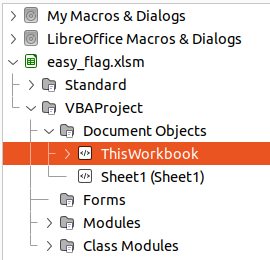

### easy_flag
Du har fått i oppgave å analysere et Excel-ark for å se om det kan inneholde en skjult melding.

I god stil er oppgavefilen pakket i en kryptert zip. (passord infected)

#### Filer
easy_flag.zip

#### Løsning
Når man åpner excel arket får man en advarsel om det det inneholder macros. Hvis vi tar en titt på hva de inneholder finner man flagget:



```vb
Option VBASupport 1
Private Sub Workbook_Open()
    flag = "helsectf{maldoc=malicious_document}"
End Sub
```