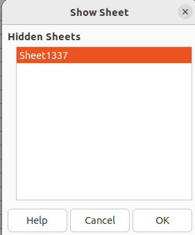

### Hidden
Enda et Excel-ark! Men denne gangen fant vi ingen macroer... Men hvor er flagget?

I god stil er oppgavefilen pakket i en kryptert zip. (passord infected)

#### Filer
hidden.zip

#### Løsning
Her er det et usynlig ark som man må åpne.

Åpner man det får man flagget i base64: `aGVsc2VjdGZ7dXN5bmxpZ19hcmshfQ==`.

`helsectf{usynlig_ark!}`