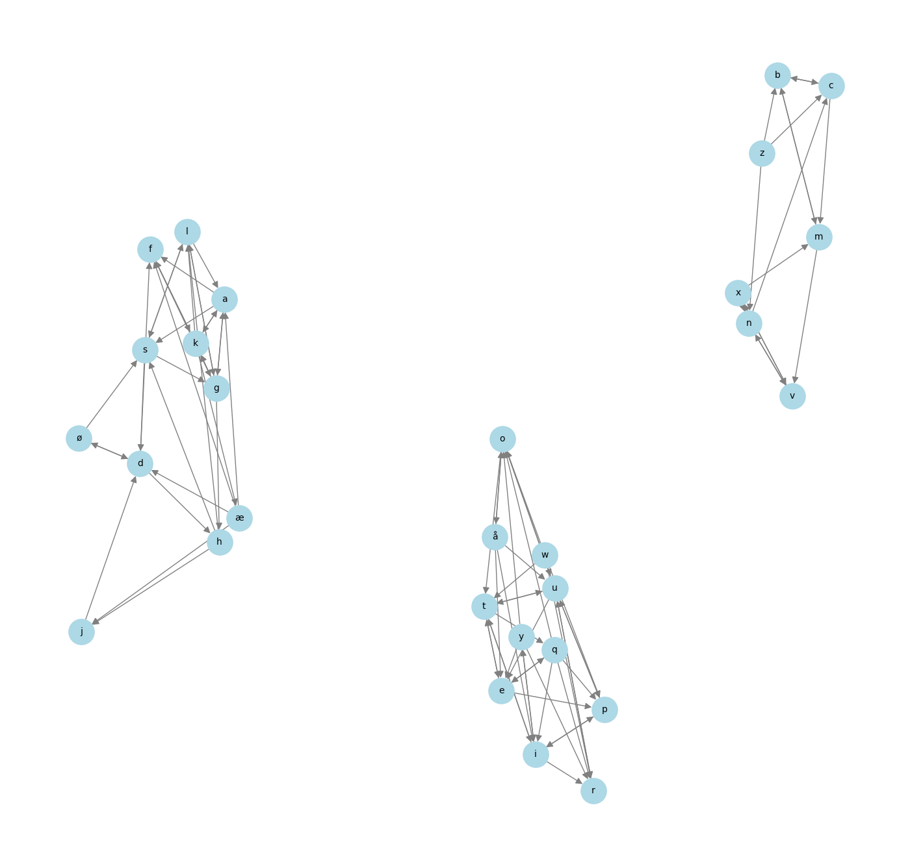

### Bokstavkrypto

Analyseavdelingen har fanget opp en klartekst med tilhørende chiffertekst, men det siste avsnittet av klarteksten mangler.

Alle de uavhengige kryptografene våre insisterer på at det er viginere-cipher som er brukt, og vi stoler på dem, men vi kan ikke skjønne hvordan de kan ha rett.

Analyseavdelingen mangler kapasitet til å se på dette, og håper du har tid. De foreslår at du analyserer de første avsnittene, så skal du greie å dekryptere den siste delen.


#### Hint
Analyseavdelingen er sikre på at kryptoen er 100% Vigenèrechiffer. En kryptolog er satt på saken. Hen har begynt å analysere bokstavene med piler og baner.

Se vedlagt bilde (til oppgaven)


#### Filer
chiffertekst.txt

klartekst.txt

bokstavkrypto_piler_og_baner.png


#### Løsning
Etter fire dager med kun én person som hadde løst opppgaven, kom de ut med et hint. Dette hintet viser tre grupper med bokstaver, hvor pilene viser hvilke klartekst bokstaver som går til hvilke chiffertekst bokstaver. Etter å ha kikket litt på dette bildet innså jeg at det var akkurat den samme koblingen jeg hadde funnet selv ved å hente bokstavende på samme indeks.

Listen med bokstavkoblinger jeg genererte er den følgende:
```python
{'ø': ['d', 's'], 'q': ['e', 'o', 'i', 'r', 'p'], 'w': ['t', 'r', 'o', 'p'], 'x': ['v', 'n', 'm'], 'l': ['a', 'g', 's'], 'i': ['r', 't', 'y', 'p'], 't': ['e', 'i', 'u', 'q'], 'f': ['g', 'k'], 'g': ['a', 'l', 'h', 'k'], 'z': ['n', 'b', 'c'], 'u': ['e', 'o', 't', 'r', 'p'], 'v': ['n', 'x'], 'æ': ['f', 'd', 'a', 'j'], 'y': ['r', 'e', 'o', 'i'], 'a': ['s', 'k', 'g', 'f'], 'd': ['h', 'ø', 'f'], 'p': ['i', 'u'], 'h': ['l', 's', 'j'], 'å': ['e', 'i', 'o', 'u'], 'k': ['a', 'f', 'l', 'æ'], 's': ['d', 'l', 'g'], 'o': ['t', 'u', 'å'], 'c': ['m', 'b'], 'n': ['v', 'c'], 'j': ['d'], 'e': ['t', 'p', 'q'], 'm': ['b', 'v'], 'b': ['m', 'c'], 'r': ['u']}
```
Jeg genererte et bilde av mine koblinger for å se om det var noe likhet:



Plasseringen på ting er ikke det samme, men innholdet er identisk (med unntak av pilretningen, men det er ikke relevant).

Jeg tenkte at man kanskje kunne gjette seg frem til hva flagget kunne være med bruk av disse koblingene. Jeg prøvde å generere alle mulige kombinasjoner av flagget i tillegg til å sammenligne med norske, franske og latinske ordbøker. Ingen lykke her. Så jeg prøvde å finne ord som var >80% like, ingen lykke der heller. Jeg prøvde til og med å bruke ulike frekvensanalyser og sannsynlighetsberegning for å finne det mest sannsynlige flagget, som ga meg følgende resultater:

`frekvensanalyse (bokstaver) + gyldige bokstaver = hellicyd{didehruidee-kdcchirddrkbblhh}`

`frekvensanalyse (nøkkel)    + gyldige bokstaver = aelsemra{aedlaetedee-sannareddesbmlaa}`

Det er jo noen bokstaver der som er korrekte, men ikke nok til at jeg kan gjette flagget. Det eneste jeg fant ut med disse metodene var at det siste avsnittet var latinsk, og etter å ha funnet svaret fikk jeg bekreftet at jeg med suksess hadde klart å bruteforce store deler av det siste avsnittet. Dessverre hjelper ikke dette mye med flagget.

Siden det ikke var noen mønster i nøkkelen jeg genererte for klarteksten, og ingenting i frekvensanalysen eller sannsynlighetsberegningen måtte det være en annen løsning.

Kikker man på bildet kan man se at de tre gruppene det er delt inn i er rader på tastaturet:

`qwertyuiopå`

`asdfghjkløæ`

`zxcvbnm`

Hver bokstav blir kryptert til en annen bokstav på samme rad. Dette kan bety at teksten kan ha vært kryptert i tre omganger, en gang for hver rad av tastaturet. Hvis vi prøver å manuelt finne nøkkelen til hver bokstavgruppe får vi følgende resultat:

Alfabet: qwertyuiopå \
Nøkkel: poteter

Alfabet: asdfghjkløæ \
Nøkkel: klægg

Alfabet: zxcvbnm \
Nøkkel: nvc

Får å finne nøkkelen prøver vi oss frem til vi får forventet resultat, det vil si at bokstavene som er i alfabetet vårt endrer seg til det vi har i klarteksten. Etter vi har fullført et alfabet, kopierer vi resultatet fra det og bruker det som chiffertekst på neste alfabet. Vi gjør dette for alle alfabetene Dette gir oss flagget:

`helsectf{duklartedet-facbaeeddefbbdaa}`


