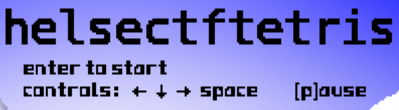

### Tetris2
Før du starter spillet står det hvilke taster som kan brukes for å styre spillet. Én av tastene er ikke listet og gir uante muligheter. Bruk tasten mye og få et flagg.

#### Løsning
Når man åpner spillet får man opp hvilke taster som kan brukes i spillet, men ikke alle er listet. For å finne den skjulte tasten kan vi åpne opp koden og kikke. Her finner vi funksjonen `keyPress`

```javascript
function keyPress(e) {
    if (currentMode == "TETRIS") {
        if (e.code == "ArrowLeft") {
            move(-1);
        };
        if (e.code == "ArrowRight") {
            move(1);
        };
        if (e.code == "ArrowDown") moveDown(1);
        if (e.code == "ArrowUp" && beenBelow) {
            if (currentY > -3) { currentY -= 1; drawFrame(frame); }
            else { state[38] = state[39] = state[40] = 40 + currentX * 6; state[41] = currentTetro; state[42] = currentRot; newTetro();}
        }
        if (e.code == "Space") rotate();
        if (e.code == "KeyP") {
            currentMode = "PAUSE";
            stopTimer();
        }
```

Instruksene i spillet er:\


I denne situasjonen ser vi at `ArrowUp` ikke er nevnt i instruksjonene, men det er inkludert i koden. For å løse oppgaven, må man trykke på opp-pilen til brikken forsvinner fra skjermen. Men det er også en viktig detalj her: if-setningen kontrollerer også variabelen `beenBelow`. `beenBelow` er en indikator på om brikken befinner seg nær bunnen av spillebrettet. Derfor vil opp-pilen kun fungere når brikken er plassert i bunnen av brettet

`helsectf{meisebolle}`
