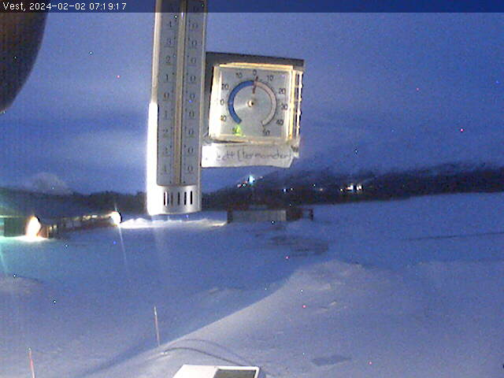

### Fallskjermhopper
En fallskjermhopper hadde en papirlapp i lomma da hun hoppet ut av et fly i nærheten av Oppdal. Lappen har falt ut av lomma, men opptil flere fugler har hvisket til henne at den landet i nærheten av et kamera. Kan du se om du finner den? OBS: Lysforhold kan gjøre lappen være litt vanskelig å lese. Men du har mer enn 1000 forsøk, og får ingen straff for å svare feil.

#### Løsning
Her Googlet jeg "kamera Oppdal" og fant nettsiden vindnå.no som har flere live kamera fra Oppdal. Etter å ha kikket litt her fant jeg noe [merkelig](http://toggles.skydiveoppdal.no/webcam/webcam_west.jpg). Her var det et termometer med en lapp på.

Teksten er litt vanskelig å lese, men det kan se ut som om det står "termometer".

`helsectf{termometer}`