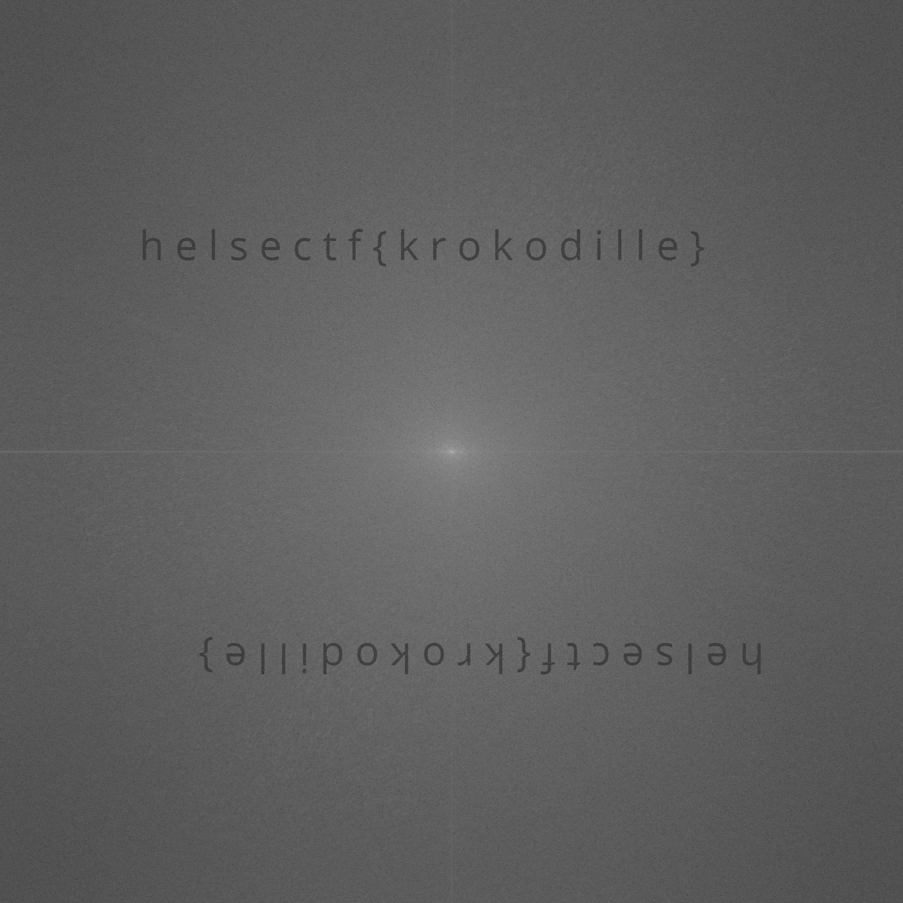

### ImageProcessing1
fourier-transformasjoner kan brukes til mye innenfor bildeprosessering. man kan lett beregne en diskret fourier-transformasjon til et bilde i python:

```python
ft = numpy.fft.fft2(img_data)
```
en vanlig måte å visualisere en kompleks fourier transformasjon på er å skyve den slik at origo, og de laveste frekvensene havner i midten av visualiseringen. for å visualisere komplekse tall i vanlige grå-farger tar man gjerne normen / absoluttverdien til de komplekse verdiene. det er også vanlig å visualisere det med en logaritmisk skala, siden endringene i frekvens-intensiteten ofte er numerisk liten:

```python
fshift = numpy.fft.fftshift(ft)
spectrum = numpy.log(numpy.abs(fshift))
```
hva skjuler seg i dette bildet av et ekorn?

#### Filer
ekorn.png

#### Løsning
Med bruk eksemplene vi fikk, i tillegg til litt stackoverflow klarte jeg å sette i sammen koden: 

```python
import numpy as np
from PIL import Image

img_path = "ekorn.png"
img = Image.open(img_path)
img_data = np.array(img)

ft = np.fft.fft2(img_data)
fshift = np.fft.fftshift(ft)
spectrum = np.log(np.abs(fshift))

im = Image.fromarray(spectrum.astype(np.uint8))
im.save("flagg.png")
```

Bildet var litt mørkt, så jeg økte lysstyrken.
