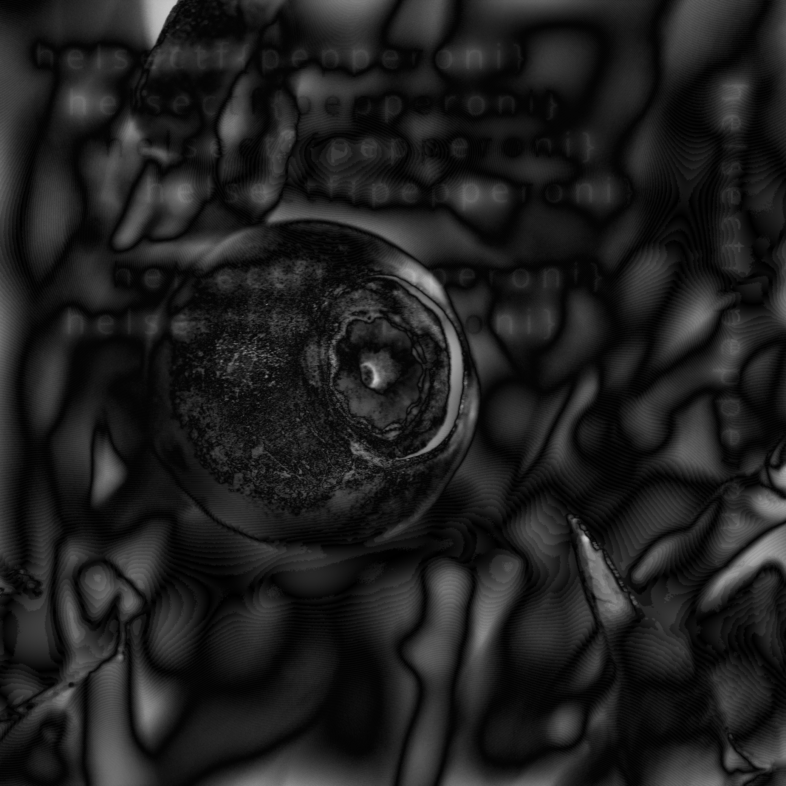

### ImageProcessing2
fourier-transformasjonen til et bilde kan brukes til mye nyttig, blant annet til edge-detection. et high-pass filter vil slippe gjennom høye frekvenser, men stoppe lave frekvenser. de lave frekvensene beskriver de store og grove detaljene i bildet, mens de høye frekvensene beskriver små detaljer og harde linjer, teksturer og hår f.eks.

ved å fjerne de lave frekvensene kan vi lettere se de høye frekvensene og kanter og detaljer kommer bedre fram.

jeg har lagt ved et bilde av et blåbær, men det er dessverre nokså skadet og ting har glidd litt sammen, så det er umulig å se detaljene i bildet. se om du klarer å få frem noen detaljer!

tips! prøv gjerne litt forskjellige masker med forskjellige verdier.

#### Filer
blabr.png

#### Løsning
Her ble det bruk for mye stackoverflow kode, men jeg kom til slutt frem til dette scriptet:
```python
import numpy as np
from PIL import Image

img_path = "blabr.png"
blueberry_img = Image.open(img_path)
blueberry_data = np.array(blueberry_img)

ft_blueberry = np.fft.fft2(blueberry_data)
fshift_blueberry = np.fft.fftshift(ft_blueberry)

def high_pass_filter_mask(size, cutoff):
    mask = np.ones(size, dtype=bool)
    center = np.array(size) // 2
    x, y = np.ogrid[:size[0], :size[1]]
    mask_area = (x - center[0]) ** 2 + (y - center[1]) ** 2 <= cutoff**2
    mask[mask_area] = False
    return mask

cutoff = 6
hp_filter = high_pass_filter_mask(blueberry_data.shape, cutoff)
hp_fshift = fshift_blueberry * hp_filter

inv_hp_img = np.fft.ifft2(np.fft.ifftshift(hp_fshift))
inv_hp_img = np.abs(inv_hp_img)

# Increase brightness
brightness_factor = 20  # Adjust this value to control brightness
inv_hp_img_bright = np.clip(inv_hp_img * brightness_factor, 0, 255)

Image.fromarray(inv_hp_img_bright.astype(np.uint8)).save("blåbær.png")
```
Jeg merket at bildet fort ble helt svart når jeg økte `cutoff` verdien, så jeg måtte øke lysstyrken for at det kunne bli lest noe. Cutoff mellom 1-10 får frem lesbar tekst, men selv med økt lysstyrke er det litt vrient å se at det er tekst der. 



`helsectf{pepperoni}`