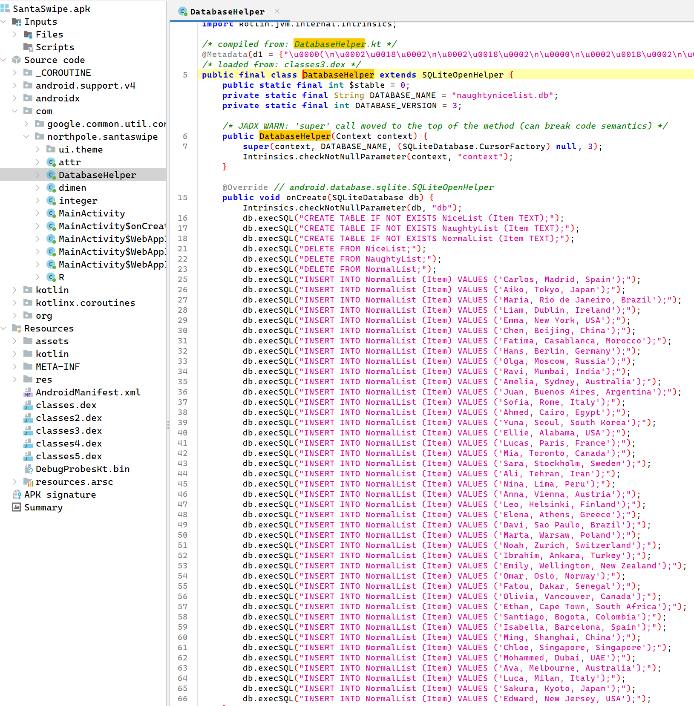
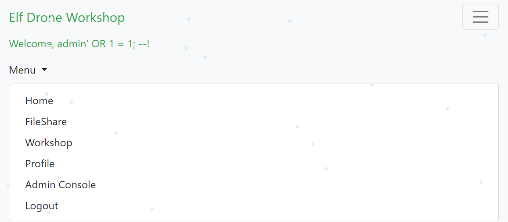
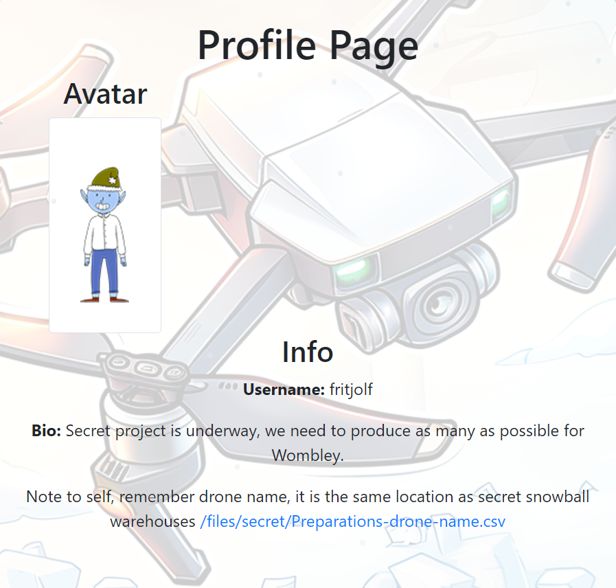
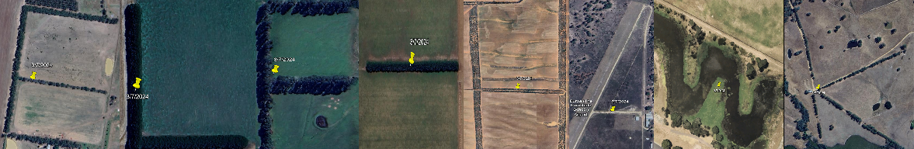
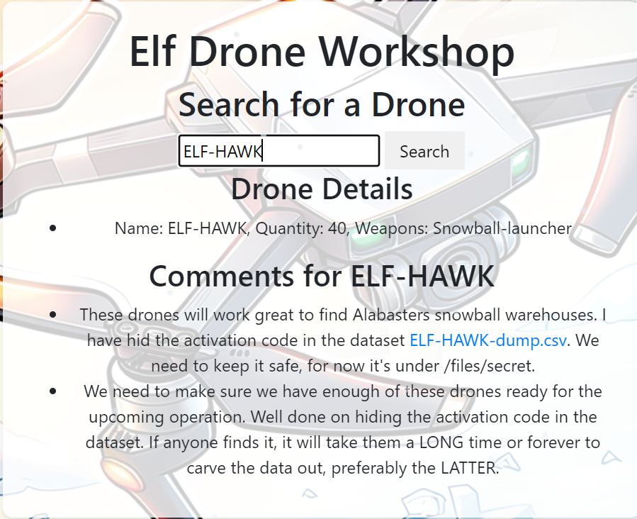
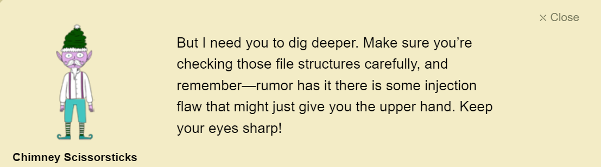
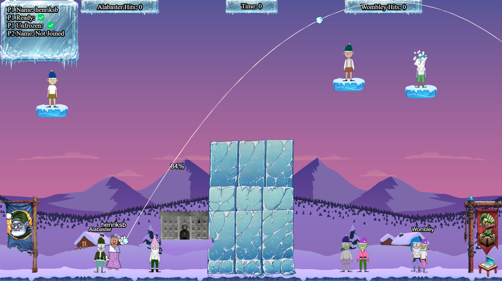
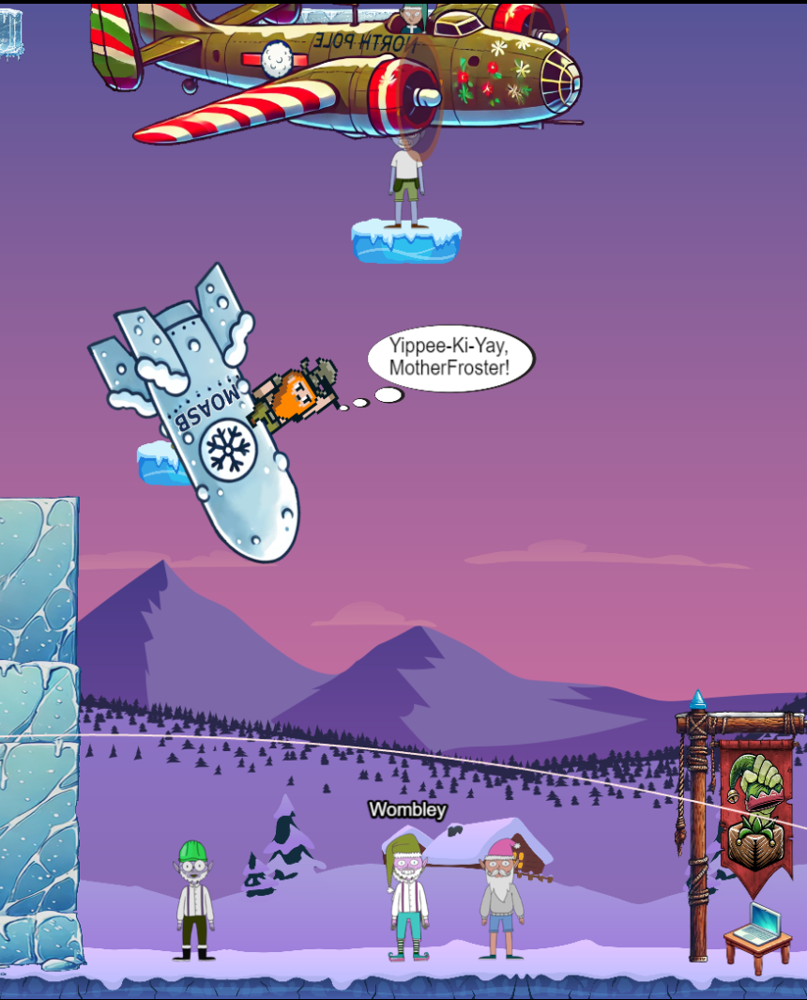
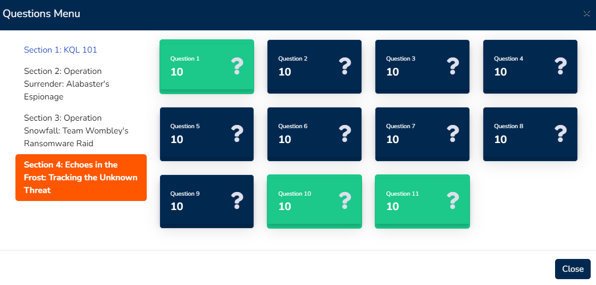

# Act 2

## Mobile Analysis
In this challenge, we were given an Android application that was made to easily add children to a naughty or nice list. We got one debug APK, and one release version. A child's name has been left in each version, but the names were forgotten. Our task is to find the two names.

I started with opening the debug version in [jadx](https://github.com/skylot/jadx), a great tool for analyzing APK files. In `com/northpole.santaswipe`, I found the function for interacting with the SQL database. This function included a lot of names.



I saved the data in a text file and decided to take a look at the release version. The release version was not an APK file, but an AAB (Android App Bundle) file. I could not open this in jadx, as this is a publishing file format. I had to unpack the file before I could analyze it. To do this, I used a tool called [bundletool](https://github.com/google/bundletool).

`java -jar bundletool-all-1.17.2.jar build-apks --bundle=SantaSwipeSecure.aab --output=release.apks     --mode=universal --ks ~/.android/debug.keystore --ks-key-alias androiddebugkey --ks-pass pass:android`

This produced an APK called `universal.apk`. I opened it in jadx and opened the `DatabaseHelper` file, where I saw a few differences. The data was encrypted.

```java
public final class DatabaseHelper extends SQLiteOpenHelper {
    private static final String DATABASE_NAME = "naughtynicelist.db";
    private static final int DATABASE_VERSION = 1;
    private final byte[] encryptionKey;
    private final byte[] iv;
    private final SecretKeySpec secretKeySpec;
    public static final int $stable = 8;

    /* JADX WARN: 'super' call moved to the top of the method (can break code semantics) */
    public DatabaseHelper(Context context) {
        super(context, DATABASE_NAME, (SQLiteDatabase.CursorFactory) null, 1);
        Intrinsics.checkNotNullParameter(context, "context");
        String string = context.getString(R.string.ek);
        Intrinsics.checkNotNullExpressionValue(string, "getString(...)");
        String obj = StringsKt.trim((CharSequence) string).toString();
        String string2 = context.getString(R.string.iv);
        Intrinsics.checkNotNullExpressionValue(string2, "getString(...)");
        String obj2 = StringsKt.trim((CharSequence) string2).toString();
        byte[] decode = Base64.decode(obj, 0);
        Intrinsics.checkNotNullExpressionValue(decode, "decode(...)");
        this.encryptionKey = decode;
        byte[] decode2 = Base64.decode(obj2, 0);
        Intrinsics.checkNotNullExpressionValue(decode2, "decode(...)");
        this.iv = decode2;
        this.secretKeySpec = new SecretKeySpec(decode, "AES");
    }


 @Override // android.database.sqlite.SQLiteOpenHelper
    public void onCreate(SQLiteDatabase db) {
        Intrinsics.checkNotNullParameter(db, "db");
        db.execSQL("CREATE TABLE IF NOT EXISTS NiceList (Item TEXT);");
        db.execSQL("CREATE TABLE IF NOT EXISTS NaughtyList (Item TEXT);");
        db.execSQL("CREATE TABLE IF NOT EXISTS NormalList (Item TEXT);");
        db.execSQL(decryptData("IVrt+9Zct4oUePZeQqFwyhBix8cSCIxtsa
        +lJZkMNpNFBgoHeJlwp73l2oyEh1Y6AfqnfH7gcU9Yfov6u70cUA2/OwcxVt7Ubdn0UD2kImNsclEQ9M8PpnevBX3mXlW2QnH8+Q
        +SC7JaMUc9CIvxB2HYQG2JujQf6skpVaPAKGxfLqDj
        +2UyTAVLoeUlQjc18swZVtTQO7Zwe6sTCYlrw7GpFXCAuI6Ex29gfeVIeB7pK7M4kZGy3OIaFxfTdevCoTMwkoPvJuRupA6ybp36vmLLMXa
        AWsrDHRUbKfE6UKvGoC9d5vqmKeIO9elASuagxjBJ"));
        insertInitialData(db);
    }

    @Override // android.database.sqlite.SQLiteOpenHelper
    public void onUpgrade(SQLiteDatabase db, int oldVersion, int newVersion) {
        Intrinsics.checkNotNullParameter(db, "db");
        db.execSQL("DROP TABLE IF EXISTS NiceList");
        db.execSQL("DROP TABLE IF EXISTS NaughtyList");
        db.execSQL("DROP TABLE IF EXISTS NormalList");
        onCreate(db);
    }

    private final void insertInitialData(SQLiteDatabase db) {
        Iterator it = CollectionsKt.listOf((Object[]) new String[]{"L2HD1a45w7EtSN41J7kx/
        hRgPwR8lDBg9qUicgz1qhRgSg==", "IWna1u1qu/4LUNVrbpd8riZ+w9oZNN1sPRS2ujQpMqAAt114Yw==", "MWfO0
        +M1t5IvQtN2ad9w3hp81sYQIIaX6veq03bnk6I4H/1n89gW", "LmHJ164506skXdh3K9MZ/BBiw90TRO2mD0Hp9Nuoxu4ghx5/WQ==",
         "J2XF2645xKciX9RgK9MR+wZ60NIbKIsOTRSHP0jkBJPaF0djlqbc", 
         "LGfJ0q451qslWt14aZd8rjtr1ZMtJItIvrKk8RRQWh2U6bQSEdPga59XDQ==", "LWTBzOt4u/
         4KXt99aJ18riBgy8cSJcpvtrKnM4IEsMDr9AwtlSJW+S/jdoHvXA=="}).iterator();
        while (it.hasNext()) {
            db.execSQL("INSERT INTO NormalList (Item) VALUES ('" + StringsKt.trim((CharSequence) it.next()).toString() + "');");
        }
    }
```

I have removed a lot of the encrypted string for readability.

Luckily, the key and encryption method is all there. But, I still needed the `ek` and `iv`. I decided to do a search and found them:

```
root@henrik:~# grep -ri "ek" release_apk/res/values/
>> release_apk/res/values/strings.xml:    <string name="ek">rmDJ1wJ7ZtKy3lkLs6X9bZ2Jvpt6jL6YWiDsXtgjkXw=</string>

root@henrik:~# grep -ri "ek" release_apk/res/values/
>> release_apk/res/values/strings.xml:    <string name="iv">Q2hlY2tNYXRlcml4</string>
```

Perfect, now I had everything I needed to decrypt it.

I created a [python script](Mobile%20Analysis/Script/decrypt_names.py) to decrypt the strings. After decrypting I got a big list of names, a lot bigger than the debug version. Some names were duplicates, which I removed, but it was still a lot bigger. I also realized that they were probably only looking for first names, so again, I could remove a lot of data. The result after trying to find missing names was the following:

```ps
PS C:\Users\h-byg\Desktop\HolidayHackChallenge2024\Act 2> python.exe .\decrypt_names.py
Only in Debug: ['Aiko', 'Amelia', 'Ava', 'Chloe', 'Davi', 'Edward', 'Ellie', 'Ethan', 'Fatou', 'Ibrahim', 'Leo', 'Lucas', 'Ming', 'Mohammed', 'Olga', 'Ravi', 'Sakura', 'Santiago', 'Yuna']

Only in Release: ['Adam', 'Aiden', 'Aisha', 'Alex', 'Alexandre', 'Alina', 'Amir', 'Ana', 'Anastasia', 'Andrei', 'Anita', 'Anton', 'Arjun', 'Catherine', 'Daniel', 'David', 'Diego', 'Dimitri', 'Edwards', 'Elias', 'Elif', 'Emmanuel', 'Enzo', 'Eva', 'Felix', 'George', 'Grace', 'Helena', 'Isabel', 'Jonas', 'Jorge', 'Jose', 'Joshua', 'Julia', 'Kai', 'Khadija', 'Kim', 'Laura', 'Leila', 'Leon', 'Lina', 'Linda', 'Luc', 'Lucia', 'Luis', 'Marie', 'Mateo', 'Mateusz', 'Mei', 'Michael', 'Michal', 'Miko', 'Mustafa', 'Nadia', 'Nikolai', 'Nora', 'Peter', 'Rafael', 'Robert', 'Rosa', 'Samuel', 'Simon', 'Stefan', 'Tom', 'Tomás', 'Victor', 'Yasmine', 'Youssef', 'Yuki', 'Zara']
```

The list was a little bit smaller, so I decided to go through the lists and see if they were correct. After a few wrong attempts I got it correct. I don't think I solved it the intended way.


## Powershell

In this challenge we enter a terminal which is using powershell. We get a series of tasks which we have to solve using powershell. Here are my solutions.

1) There is a file in the current directory called 'welcome.txt'. Read the contents of this file

```ps
Get-Content ./welcome.txt
```

2) Geez that sounds ominous, I'm sure we can get past the defense mechanisms. 
We should warm up our PowerShell skills. 
How many words are there in the file?

```ps
Get-Content ./welcome.txt | Measure-Object -Word
```

3) There is a server listening for incoming connections on this machine, that must be the weapons terminal. What port is it listening on?

```ps
netstat -an
```

4) You should enumerate that webserver. Communicate with the server using HTTP, what status code do you get?

```ps
Invoke-WebRequest -Uri http://127.0.0.1:1225 -Method GET -ErrorAction SilentlyContinue
```

5) It looks like defensive measures are in place, it is protected by basic authentication. 
Try authenticating with a standard admin username and password.

```ps
$credential = Get-Credential # Use admin/admin

Invoke-WebRequest -Uri http://127.0.0.1:1225 -Method GET -Credential $credential -AllowUnencryptedAuthentication

>> StatusCode        : 200       
StatusDescription : OK
Content           : <html>
                    <body>
                    <pre>
                    ----------------------------------------------------
                    🪖 Elf MFA webserver🪖
                    ⚔️ Grab your tokens for access to weaponry ⚔️
                    ⚔️ Warning! Sensitive information on the server, protect a…
RawContent        : HTTP/1.1 200 OK
                    Server: Werkzeug/3.0.6
                    Server: Python/3.10.12
                    Date: Tue, 19 Nov 2024 19:06:08 GMT
                    Connection: close
                    Content-Type: text/html; charset=utf-8
                    Content-Length: 3475
                    
                    <html>
                    <body>
                    <pre>
                    ---…
Headers           : {[Server, System.String[]], [Date, System.String[]], [Connection, System.S
                    tring[]], [Content-Type, System.String[]]…}
Images            : {}
InputFields       : {}
Links             : {@{outerHTML=<a href="http://localhost:1225/endpoints/1">Endpoint 1</a>; t
                    agName=A; href=http://localhost:1225/endpoints/1}, @{outerHTML=<a href="ht
                    tp://localhost:1225/endpoints/2">Endpoint 2</a>; tagName=A; href=http://lo
                    calhost:1225/endpoints/2}, @{outerHTML=<a href="http://localhost:1225/endp
                    oints/3">Endpoint 3</a>; tagName=A; href=http://localhost:1225/endpoints/3
                    }, @{outerHTML=<a href="http://localhost:1225/endpoints/4">Endpoint 4</a>;
                     tagName=A; href=http://localhost:1225/endpoints/4}…}
RawContentLength  : 3475
RelationLink      : {}
```

6) There are too many endpoints here. 
Use a loop to download the contents of each page. What page has 138 words? 
When you find it, communicate with the URL and print the contents to the terminal.

```ps
$securePassword = ConvertTo-SecureString 'admin' -AsPlainText -Force
$credential = New-Object System.Management.Automation.PSCredential('admin', $securePassword)
(Invoke-WebRequest -Uri "http://127.0.0.1:1225" -Credential $credential -AllowUnencryptedAuthentication -ErrorAction SilentlyContinue).Links | ForEach-Object { 
    $url = $_.href
    $response = Invoke-WebRequest -Uri $url -Credential $credential -AllowUnencryptedAuthentication -ErrorAction SilentlyContinue
    if ($response.StatusCode -eq 200 -and ($response.Content -split '\s+').Count -eq 138) { 
        Write-Host "Page with 138 words found: $url"
        Write-Host "Contents:"
        Write-Host $response.Content
        break 
    } 
}

Page with 138 words found: http://localhost:1225/endpoints/13                                  
Contents:
<html><head><title>MFA token scrambler</title></head><body><p>Yuletide cheer fills the air,<br>    A season of love, of care.<br>    The world is bright, full of light,<br>    As we celebrate this special night.<br>    The tree is trimmed, the stockings hung,<br>    Carols are sung, bells are rung.<br>    Families gather, friends unite,<br>    In the glow of the fire’s light.<br>    The air is filled with joy and peace,<br>    As worries and cares find release.<br>    Yuletide cheer, a gift so dear,<br>    Brings warmth and love to all near.<br>    May we carry it in our hearts,<br>    As the season ends, as it starts.<br>    Yuletide cheer, a time to share,<br>    The love, the joy, the care.<br>    May it guide us through the year,<br>    In every laugh, in every tear.<br>    Yuletide cheer, a beacon bright,<br>    Guides us through the winter night </p><p> Note to self, remember to remove temp csvfile at http://127.0.0.1:1225/token_overview.csv</p></body></html>
```

7) There seems to be a csv file in the comments of that page. 
 That could be valuable, read the contents of that csv-file!

```ps
(Invoke-WebRequest -Uri "http://127.0.0.1:1225/token_overview.csv" -Credential (New-Object PSCredential('admin', (ConvertTo-SecureString 'admin' -AsPlainText -Force))) -AllowUnencryptedAuthentication -ErrorAction SilentlyContinue).Content

724d494386f8ef9141da991926b14f9b,REDACTED
67c7aef0d5d3e97ad2488babd2f4c749,REDACTED
5f8dd236f862f4507835b0e418907ffc,4216B4FAF4391EE4D3E0EC53A372B2F24876ED5D124FE08E227F84D687A7E06C
# [*] SYSTEMLOG
# [*] Defence mechanisms activated, REDACTING endpoints, starting with sensitive endpoints
# [-] ERROR, memory corruption, not all endpoints have been REDACTED
# [*] Verification endpoint still active
# [*] http://127.0.0.1:1225/tokens/<sha256sum>
# [*] Contact system administrator to unlock panic mode
# [*] Site functionality at minimum to keep weapons active
```

8) Luckily the defense mechanisms were faulty! 
There seems to be one api-endpoint that still isn't redacted! Communicate with that endpoint!

```ps
Invoke-WebRequest -Uri "http://127.0.0.1:1225/tokens/4216B4FAF4391EE4D3E0EC53A372B2F24876ED5D124FE08E227F84D687A7E06C" -Credential (New-Object PSCredential('admin', (ConvertTo-SecureString 'admin' -AsPlainText -Force))) -AllowUnencryptedAuthentication -ErrorAction SilentlyContinue | Select-Object -ExpandProperty Content
```

9) It looks like it requires a cookie token, set the cookie and try again.

```ps
# Define the token value from the CSV file
$tokenValue = "5f8dd236f862f4507835b0e418907ffc"

# Create a new web request session
$session = New-Object Microsoft.PowerShell.Commands.WebRequestSession

# Add the cookie to the session
$cookie = New-Object System.Net.Cookie("token", $tokenValue, "/", "127.0.0.1")
$session.Cookies.Add($cookie)

# Prepare the credentials
$securePassword = ConvertTo-SecureString 'admin' -AsPlainText -Force
$credential = New-Object System.Management.Automation.PSCredential('admin', $securePassword)

# Make the web request with the session
$url = "http://127.0.0.1:1225/tokens/4216B4FAF4391EE4D3E0EC53A372B2F24876ED5D124FE08E227F84D687A7E06C"
$response = Invoke-WebRequest -Uri $url -Credential $credential -WebSession $session -AllowUnencryptedAuthentication -ErrorAction SilentlyContinue

# Display the content
$response.Content

>> <h1>Cookie 'mfa_code', use it at <a href='1732228671.25296'>/mfa_validate/4216B4FAF4391EE4D3E0EC53A372B2F24876ED5D124FE08E227F84D687A7E06C</a></h1>
```
10) Sweet we got a MFA token! We might be able to get access to the system.
 Validate that token at the endpoint!

```ps
# Step 1: Create a new web request session
$session = New-Object Microsoft.PowerShell.Commands.WebRequestSession

# Step 2: Prepare the credentials
$securePassword = ConvertTo-SecureString 'admin' -AsPlainText -Force
$credential = New-Object System.Management.Automation.PSCredential('admin', $securePassword)

# Step 3: Add the 'token' cookie to the session
$tokenValue = "5f8dd236f862f4507835b0e418907ffc"  # Token from the CSV file
$cookieToken = New-Object System.Net.Cookie("token", $tokenValue, "/", "127.0.0.1")
$session.Cookies.Add($cookieToken)

# Step 4: Request the tokens endpoint to get the MFA token
$tokenUrl = "http://127.0.0.1:1225/tokens/4216B4FAF4391EE4D3E0EC53A372B2F24876ED5D124FE08E227F84D687A7E06C"
$response = Invoke-WebRequest -Uri $tokenUrl -Credential $credential -WebSession $session -AllowUnencryptedAuthentication -ErrorAction Stop

# Step 5: Extract the MFA token and validation URL from the response

$content = $response.Content
$mfaTokenMatch = [regex]::Match($content, "href='([^']+)'")
$validationPathMatch = [regex]::Match($content, "<a href='[^']+'>([^<]+)</a>")
if ($mfaTokenMatch.Success -and $validationPathMatch.Success) {
    $mfaToken = $mfaTokenMatch.Groups[1].Value
    $validationPath = $validationPathMatch.Groups[1].Value
} else {
    Write-Host "Failed to extract MFA Token and Validation URL"
    exit
}

# Build the full validation URL
$validationUrl = "http://127.0.0.1:1225" + $validationPath

# Step 6: Add the 'mfa_token' cookie to the session
$cookieMfa = New-Object System.Net.Cookie("mfa_token", $mfaToken, "/", "127.0.0.1")
$session.Cookies.Add($cookieMfa)

# Step 7: Make the web request to the validation endpoint immediately
$responseValidation = Invoke-WebRequest -Uri $validationUrl -Credential $credential -WebSession $session -AllowUnencryptedAuthentication -ErrorAction Stop

# Step 8: Display the response content
Write-Host "Validation Response:"
Write-Host $responseValidation.Content

>> <h1>[+] Success</h1><br><p>Q29ycmVjdCBUb2tlbiBzdXBwbGllZCwgeW91IGFyZSBncmFudGVkIGFjY2VzcyB0byB0aGUgc25vdyBjYW5ub24gdGVybWluYWwuIEhlcmUgaXMgeW91ciBwZXJzb25hbCBwYXNzd29yZCBmb3IgYWNjZXNzOiBTbm93TGVvcGFyZDJSZWFkeUZvckFjdGlvbg==</p>
```

11) That looks like base64! Decode it so we can get the final secret!

Decoded: `Correct Token supplied, you are granted access to the snow cannon terminal. Here is your personal password for access: SnowLeopard2ReadyForAction`


## Elf Drone Workshop
In this challenge, we were tasked with finding the admin password in drone flight logs. The menu had three different pages: Home, FileShare, and Login.

The `FileShare` page had a single file called [fritjolf-Path.kml](/Elf%20Drone%20Workshop/fritjolf-Path.kml), which was an XML-like file that included the flight data.


Just for fun, I tried to exploit the login field using a basic SQL-injection. This surprisingly worked. I used `' OR 1=1; --` as both the username and password. This gave me a few more pages:



I later realized that the KML file we received actually included a valid login. I opened the file in Google Earth and found this:


"GUMDROP1" was spelled on Antarctica. This would be the password for the account "fritjolf".

When clicking on "profile", I found a new file called [Preparations-drone-name.csv](/Elf%20Drone%20Workshop/Preparations-drone-name.csv).

This file included coordinates, and a lot of other data.



The drone name is the same as the location for the secret snowball warehouses. I converted the CSV file to a KML file using [an online service](https://www.convertcsv.com/csv-to-kml.htm), then opened it in Google Earth.

When looking at the different locations, I quickly realized that the locations were fields that were formed like letters. Using the order from the CSV file I got the following:



`ELF-HAWK`

Now, I could search for that drone.



I got a new file called [ELF-HAWK-dump.csv](/Elf%20Drone%20Workshop/ELF-HAWK-dump.csv).

I tried to convert this to KML to analyze it, but opening it in Google Earth did not help at all. After some research, I found a Python library called `folium`. This library enabled me to create a 2D representation of the data, which ultimately was needed to solve it.

```python
import folium
import pandas as pd

# Load the CSV file
csv_file_path = 'ELF-HAWK-dump.csv'
df = pd.read_csv(csv_file_path)

# Create a map centered at an average location
average_lat = df['OSD.latitude'].mean()
average_lon = df['OSD.longitude'].mean()
m = folium.Map(location=[average_lat, average_lon], zoom_start=5)

# Add drone locations to the map
for _, row in df.iterrows():
    lat, lon = row['OSD.latitude'], row['OSD.longitude']
    folium.Marker(location=[lat, lon], popup=f"Lat: {lat}, Lon: {lon}").add_to(m)

# Save the map to an HTML file
map_file = 'drone_map.html'
m.save(map_file)
print(f"Map saved to {map_file}")
```

Opening the produced HTML file revealed this:


It was a little bit hard to read, but it reads `DroneDataAnalystExpertMedal`. I delivered this code in the "Admin Code Verification Console", which gave me the silver medal.

### Injection flaw


For the gold medal, we need to find some sort of injection flaw, which I already found earlier. The only other input field I could use the same injection was on the drone search page. This gave me a few more drones:

```
Name: ELF-HAWK, Quantity: 40, Weapons: Snowball-launcher
Name: Pigeon-Lookalike-v4, Quantity: 20, Weapons: Surveillance Camera
Name: FlyingZoomer, Quantity: 4, Weapons: Snowball-Dropper
Name: Zapper, Quantity: 5, Weapons: CarrotSpike
```
The only one of interest was `Pigeon-Lookalike-v4`, which had this comment:

```
Comments for Pigeon-Lookalike-v4

This is a great drone for surveillance, but we need to keep it out of the rain.

I cant believe we are using pigeons for surveillance. If anyone finds out, there will most likely be a conspiracy theory about it.

I heard a rumor that there is something fishing with some of the files. There was some talk about only TRUE carvers would find secrets and that FALSE ones would never find it.
```

The last paragraph was the hint. `TRUE` and `FALSE`. The CSV file for ELF-HAWK is the only file that included these keywords, which were not used for solving the previous challenge.

I spent way too much time trying to plot the points where these values were true, combining different ones with no success. Then I tried to plot the ones that could indicate bad weather or rain because of this sentence in the comments:

```
This is a great drone for surveillance, but we need to keep it out of the rain.
```
No success. Turns out it was as simple as interpreting them as binary values and turning that into ASCII. I made a simple script to do this:

```python
def binary_to_text(binary_string):
    # Convert the binary string to ASCII
    return ''.join(chr(int(binary_string[i:i+8], 2)) for i in range(0, len(binary_string), 8) if len(binary_string[i:i+8]) == 8)

final_string = ""

with open("ELF-HAWK-dump.csv", "r") as csv:
    for line in csv:
        # Replace TRUE/FALSE with binary and concatenate
        binary_string = ''.join('1' if value == "TRUE" else '0' for value in line.split(",") if value in {"TRUE", "FALSE"})
        
        # Skip lines with no binary data
        if '1' in binary_string:
            final_string += binary_string

print(binary_to_text(final_string))
```

```
:::::::::::::::::::::::::::::::::::::::::::::::::::::::::::::::::::::::::::::::::::::::::
:::::::::::::::::::::::::::::::::::::::::::::::::::::::::::::::::::::::::::::::::::::::::
:::::::::::::::::::::::::::::::::::::::::::::::::::::::::::::::::::::::::::::::::::::::::
::::::::::::::::::::::::::::::::::::::::::::::::::::::::::::::::::::::*::::::::::::::::::
:::::::::::::::::::::::::::::::-------------=--------::::::::::::::::::::::::::::::::::::
::::::::::::::::::::::------------------------===-=======--=-::::::::::-:::::::::::::::::
::::::::::::::::::::------------:------------=-====================---:::::::::=+::::::::
:::::::::::::::::------------------------------=====================-------::::::::::::::
::::::::::::::-------------------------------------================:------:::::::::::::::
::::::::::::--------------------------------------==============-::--------:::::::::-::::
::::::::::::-------:--------@+:::::::::--=@--------:===========-::-::----==---:::::::::::
::::-------:::::----------@---::::::---+-==+@--------=========-:--:------=====---::::::::
::::--------::::::-------#--------------=-+@------------===------::-----====--==---::::::
::::-------:-:::::::------@=@=++#+++++@@@@@=-----------------:::--------------==---::::::
::::----------::::=-#-:----**%@+++++++%@@=::::::---%@------:--------:--@-+::-------::::::
::::-----:----:::::::::::--::@@**%@--::::::::::::::--=+@------------@--:::::------@::::::
::::---+@::::::---+@:::::::::#@-@--:::::-:=*=-::-----=+*=*=--------@:--:::::::-----=:::::
::::@-:::-::::::-----=@:-:::@+@%---------------==-==+@@@@@=@------@---------:::::--==+%::
:::#:::::::::::-----=+*@:::%#@#-=---------===++*%@@+@=+*#-+*=@-----#====-----------**-%::
::@--::-:::--:---==++*@-:@=+@=+-@=*+++++++**@#%*@-##**-@##%=#%@@@@#*@###@=+**@*****@@@:::
:::@*=--++++++++**@@@@@@*#@-+%@*=*+****@@@+@***@%@@%%%@-%@*@@@@@@@@@@@@@@%%#%%%@@@@@%::::
:::@@@@@@@++#*####@@@@@@@==---====+##@*%=+@*@*%%@@@@@@@@@@@@@@@=--@+@@@@+@@@@@@@@@@-:::::
::::=*%%%%%%%%%%%@@%@@#@-#*+++++====@-++###@%@*@@@@+@@@@-**+--::::--@@%@%%@%%%%%@@@-:::::
::::---@@@@##@@@@@@@@@--+@%-#+#**+=+++**%@@@@@@@##%**%--:::::::--*----=*@@@@@@@*@@---::::
::::---@@***%%%%@@@@*@-=-+=@#=#%##***##@@@@@#@@*@%%==---:::::::::::----=+---------=--::::
::::----@+=%#@@@=@@-----##@+:-=%@@%##%@@@@@@@@@@@@*+=-----::::::::::::=+*-@:----===--::::
::::---------------------*@##=+@@%@==-+@@@@@@@@@@@-+=---------------===+**--=======-:::::
:::---------------:------%+#%@@@@@#%%%%@@@@#@@@@@@@-+======---------==***#@========-:::::
:::-%-%---------:---------*-*##%@@@@@@@@@@@@@@@@@--=@@-*===++++++++++***@*===++++++=-::::
:::--+---------=-------:-----#==#@%%%@@@@@*@%@@@----@+@@@=***@@@@***@@@@%===++++-++=-::::
:::--------------:::::--------------##-----@@--------@%@#@@%%%%@@@@@@#@=====+++++++=-::::
:::---------------::::::---------------------=====---@@##@@@@@@@@@@@#%#-=====+++++--:::::
:::---======-------------------------=----==========--*=@@%@++*@@%%%@@-======:----==-::::
:::---===============------------------===============-----#@@@@@-----===-::---=====-::::
:::--=============+===--------------===-==================--------======::----=======-:::
:::--================---::::-=======-======================+=====+====::------===+===-:::
:::--===================--:::::====================+====-:---==+++=::-----=======---=-:::
:::--========:===========------:=====================:::-----====:-----==========+===-:::
 / ___/ _ \|  _ \| ____\ \      / / _ \|  _ \|  _ \   _____  ====:-----==========+===-:::
| |  | | | | | | |  _|  \ \ /\ / / | | | |_) | | | | |_____| ====:-----==========+===-:::
| |__| |_| | |_| | |___  \ V  V /| |_| |  _ <| |_| | |_____| ====:-----==========+===-:::
 \____\___/|____/|_____|__\_/\_/__\___/|_| \_\____/  _  _________   ______    _    ____
| ____\ \/ /  _ \| ____|  _ \_   _|_   _| | | |  _ \| |/ / ____\ \ / / ___|  / \  |  _ \
|  _|  \  /| |_) |  _| | |_) || |   | | | | | | |_) | ' /|  _|  \ V / |     / _ \ | |_) |
| |___ /  \|  __/| |___|  _ < | |   | | | |_| |  _ <| . \| |___  | || |___ / ___ \|  _ <
|_____/_/\_\_| __|_____|_|_\_\|_| __|_|  \___/|_| \_\_|\_\_____| |_| \____/_/   \_\_| \_\
\ \   / / ____|  _ \|  \/  | ____|  _ \  / \  | |    ==========---======++++=+=--+++=-:::
 \ \ / /|  _| | |_) | |\/| |  _| | | | |/ _ \ | |    ==========---======++++=+=--+++=-:::
  \ V / | |___|  _ <| |  | | |___| |_| / ___ \| |___ ==========---======++++=+=--+++=-:::
   \_/  |_____|_| \_\_|  |_|_____|____/_/   \_\_____|==========---======++++=+=--+++=-:::
::::--====+++=---++++++=+========------::::=-:---==============---======++++=+=--+++=-:::
::::--==+++++++==---+++++++++++========-----================++++==-========-++=++====-:::
:::::--====+++++-++--++++++++++=--------=-==============+++---------=====++=+++++::::::::
::::::::======+++=+++=+++++++++++++++=++++===========++++:-------=---=-=----:::::::::::::
::::::::::::::::--=-=======++=++++++++++++++============--------------:::::::::::::::::::
:::::::::::::::::::::::::::------===-==-===-==-----::-:::::::::::::::::::::::::::::::::::
:::::::::::::::::::::::::::::::::::::::::::::::::::::::::::::::::::::::::::::::::::::::::
:::::::::::::::::::::::::::::::::::::::::::::::::::::::::::::::::::::::::::::::::::::::::
```

Code is `EXPERTTURKEYCARVERMEDAL`

## Snowball Showdown



In this challenge, we were tasked with beating Wombley in a snowball game. The solution will of course be cheating!

The code for the game is fairly large, about 2100 lines of javascript. Still, it did not take too long to find a cheat. There are probably thousands of different ways of cheating this game. What I did, is removing the collision so that I could walk over to his side of the map. To do so, I simply added `return null` to the start of the function to check for collisions:

```js
isOverlapping(points, canvas) {
    return null;
    let context = canvas.context;
    for (let point of points) {
        if (point.x >= 0 && point.x < canvas.width && point.y >= 0 && point.y < canvas.height) {
            let imageData = context.getImageData(point.x, point.y, 1, 1).data;
            if (imageData[3] !== 0) {
                return point; // Return the collision point
            }
        }
    }
    return null; // Return null if no collision
```

Now, I could walk over to his side and constantly hit him with snowballs, leading to victory.

### Secret weapon

To get the gold medal, I had to find some sort of secret weapon.

```js
this.load.image('bomber1', "imgs/bomber1.png");
this.load.image('bomber2', "imgs/bomber2.png");
this.load.image('bomber_nub', "imgs/bomber_nub.png");
this.load.image('dwarf-min', "imgs/MOASB-min-dwarf.png");
```

I opened these images, which were images of planes. I started to search for the names in the code, and I found this under the function setupStatusPanels():

```js
setupStatusPanels() {
    // ... code setting up status panels ...
    this.clockPanel = this.add.image(GAME_WIDTH / 2, padding, 'panel').setOrigin(0.5, 0).setDisplaySize(200, 60);
    this.moasb = () => { this.ws.sendMessage({ type: 'moasb' }) }
```
Because `this.moasb` is defined within the class and `mainScene` is a global reference to this, I could access the moasb function globally using `mainScene.moasb`. So I ran the command in the console:

```js
mainScene.moasb();
```


A plane arrived and bombed Wombley!



## Microsoft KC7

In this challenge, we were tasked with finding information about an attack. To do this, we used a query language. Every section had about ten tasks to complete before getting the flag. So we were slowly learning the language as we went.

### KQL 101

How many distinct URLs did elves with the first name Twinkle visit?

```sql
let twinkle_ips =
Employees
| where name has "twinkle"
| distinct ip_addr;
OutboundNetworkEvents  
| where src_ip in (twinkle_ips)  
| distinct url
| count
```
The answer is 8.


### Operation Surrender

What was the filename that was created after the .doc was downloaded and executed?

```sql
ProcessEvents
| where username == "jotinseltoe"
| where process_commandline contains ""
```

```
2024-11-27T14:12:44Z C:\Users\jotinseltoe\Downloads\Team_Wombley_Surrender.doc
2024-11-27T14:12:45Z C:\Users\Public\AppData\Roaming\keylogger.exe
```
The answer is `keylogger.exe` in base64.


### Operation Snowfall

After exfiltrating critical files from Alabaster's system, Team Wombley deployed a malicious payload to encrypt the device, leaving Alabaster locked out and in disarray.

Eve Snowshoes comments, "The final blow in this attack was the ransomware they unleashed. Finding the name of the malicious file will help us figure out how they crippled the system."

What is the name of the malicious file that was run on Alabaster's laptop?

```sql
ProcessEvents
|where process_name contains "encrypt"
```

The answer is `EncryptEverything` in base64.


### Echoes in the Frost

In the previous question, we discovered that two files, sqlwriter.exe and frost.dll, were downloaded onto Noel's laptop. Immediately after, a registry key was added that ensures sqlwriter.exe will run every time Noel's computer boots.

This persistence mechanism indicates the attacker's intent to maintain long-term control over the system.

Eve Snowshoes, "Adding a registry key for persistence is a classic move by attackers to ensure their malicious software runs automatically. Is's crucial to understand how this persistence is set up to prevent further damage."

What is the name of the property assigned to the new registry key?

```sql
ProcessEvents
| where process_commandline contains "sql"
```

The answer is `frosty` in base64.


After learning the basics of the language, I realized I could just skip to the last part for every section. It was a relatively easy and intuitive language.

