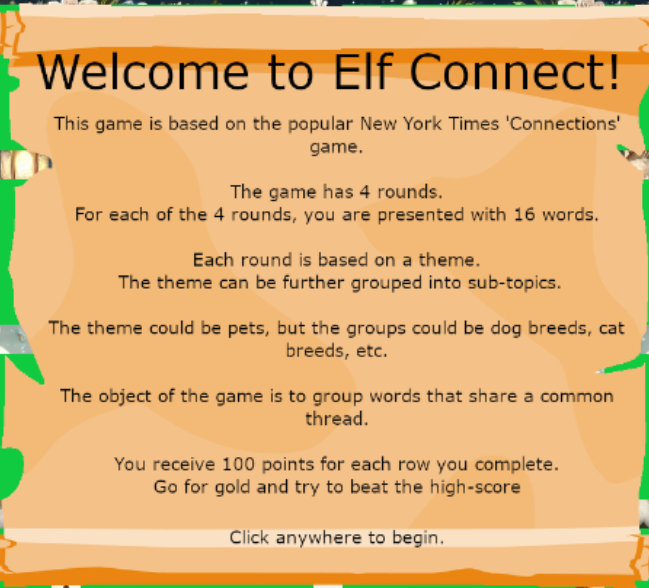
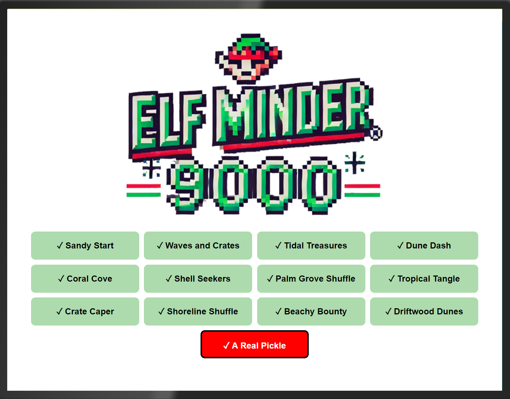
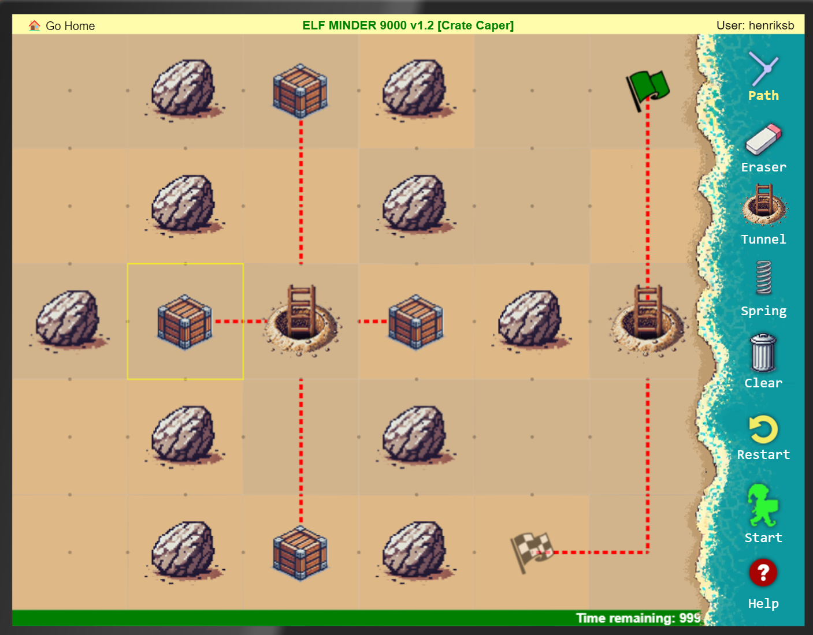
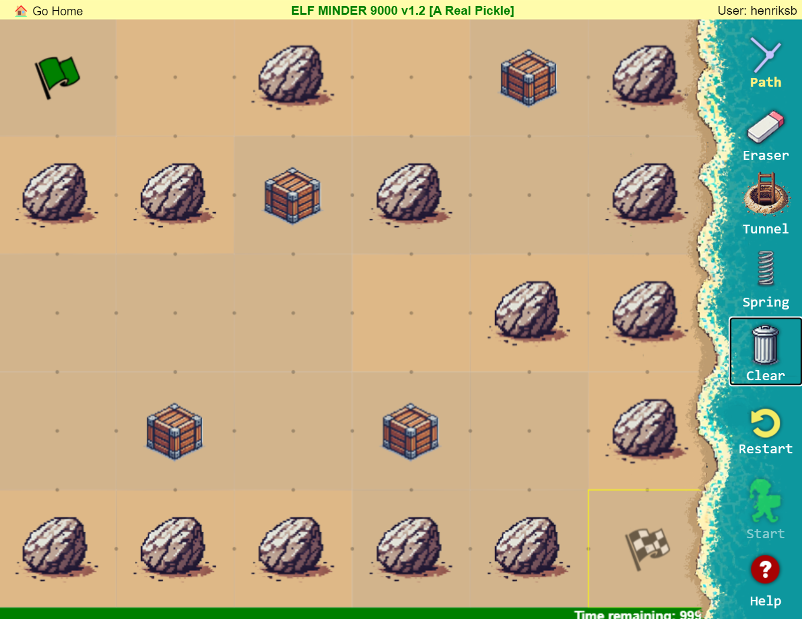
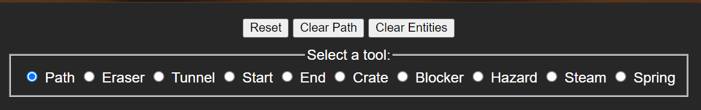

# Prologue

## First Terminal
Type "answer" in the terminal.

## Elf Connect
Word association challenge.


This task can of course be solved without knowing the answers. When looking at the javascript, we can see the following:

```js
const wordSets = {
            1: ["Tinsel", "Sleigh", "Belafonte", "Bag", "Comet", "Garland", "Jingle Bells", "Mittens", "Vixen", "Gifts", "Star", "Crosby", "White Christmas", "Prancer", "Lights", "Blitzen"],
            2: ["Nmap", "burp", "Frida", "OWASP Zap", "Metasploit", "netcat", "Cycript", "Nikto", "Cobalt Strike", "wfuzz", "Wireshark", "AppMon", "apktool", "HAVOC", "Nessus", "Empire"],
            3: ["AES", "WEP", "Symmetric", "WPA2", "Caesar", "RSA", "Asymmetric", "TKIP", "One-time Pad", "LEAP", "Blowfish", "hash", "hybrid", "Ottendorf", "3DES", "Scytale"],
            4: ["IGMP", "TLS", "Ethernet", "SSL", "HTTP", "IPX", "PPP", "IPSec", "FTP", "SSH", "IP", "IEEE 802.11", "ARP", "SMTP", "ICMP", "DNS"]
        };

        let wordBoxes = [];
        let selectedBoxes = [];
        let correctSets = [
            [0, 5, 10, 14], // Set 1
            [1, 3, 7, 9],   // Set 2
            [2, 6, 11, 12], // Set 3
            [4, 8, 13, 15]  // Set 4
```

From the following code, we can see that there are four sets of challanges, where the answer to the first one is index: 0, 5, 10, and 14.


So, the answer for the first row is:

- Prancer
- Vixen
- Blitzen
- Comet

The numbers are the same for each page.

### Beating the high score

To beat the score of 500000 points, we can simply change our score by adding the following line in the developer console:

```js
score += 1000000
```

Then finish one row of the puzzle.

## Elf Minder


This was a puzzle game with increasing diffuculty, where you have to draw a path to collect all the crates and avoid obstacles at the same time. All while having a time limit (which is way too long, by the way). To get the silver medal, just solve the puzzles the normal way. It should not take more than an hour.



You get a few tools to help you, like a spring, which lets you jump over obstacles and land on another path you have drawn. Additionally, you get a tunnel that essentially makes you teleport.

I though these were pretty fun, and solved them without cheating. But the very last challenge is not possible.

### Beating "A Real Pickle"


After some digging in the code, I found the following:
```html
<div class="admin-controls hidden">
```

I removed the `hidden` tag which revealed a pretty interesting field.



Using this, I could erase the obstacles, build my path, then restore the world. This enabled me to walk through the obstacles and make illegal moves.
