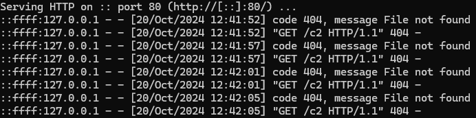
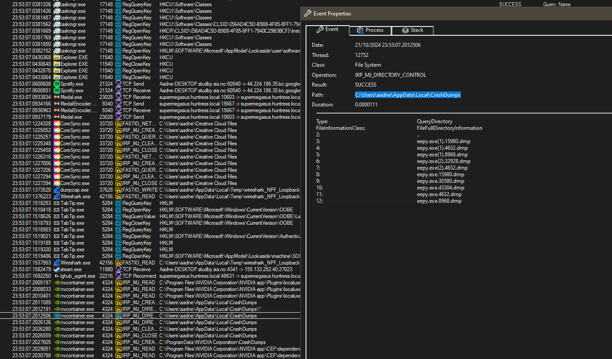
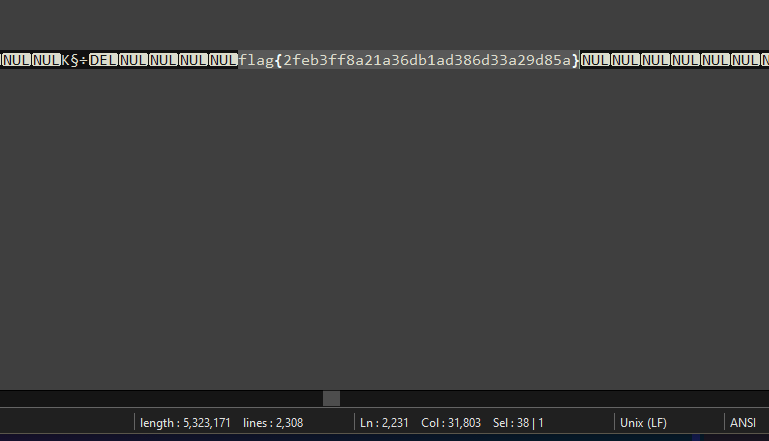

# Eepy

## Overview
Challenge involved analyzing an executable that appeared to establish a C2 (Command and Control) channel.

## Initial Analysis
The executable sent GET requests to a specific URL, in which we tried to set to localhost:80 to see what was happening:



## Solution Path
While the C2 communication was a red herring, the actual solution came from process monitoring:



## Flag Discovery
By examining the crashdump file and searching for "flag", we found:



```
flag{2feb3ff8a21a36db1ad386d33a29d85a}
```

## Note
The intended solution path may have differed, but examining the crashdump proved successful.