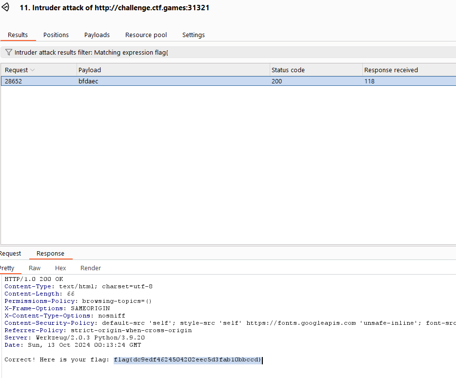

# System Code

## Challenge Description
- Web page with Matrix-style effects
- Reference to "Follow the white rabbit"
- Used effects from [matrix repository](https://github.com/Rezmason/matrix)

## Initial Analysis
- Page contained input field
- Theme based on The Matrix movie
- Hints appeared to be misleading

## Solution Path
1. Compared source code with original repository
2. Found unique matrix referencing alphabet: `[a,b,c,d,e]`
3. First attempt: Tried mapping letters to matrix rain (unsuccessful)
4. Final solution: Brute forced input using intruder attack
    - Correct input: `bfdaec`

## Flag
```
flag{dc9edf4624504202eec5d3fab10bbccd}
```

## Note
While the challenge had thematic hints, the solution ended up being a straightforward brute force of letter combinations.