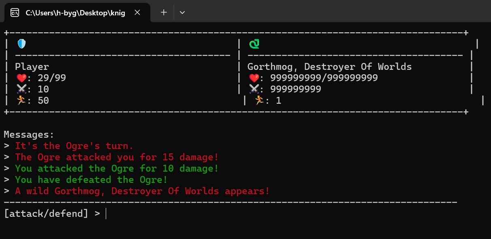

# Knight's Quest
An adventurer is YOU! Play Knight's Quest, beat the three monsters, and claim the flag! Very straightforward with no surprises, no sir-ee, no surprises here lmao

## Solution
This reverse engineering task was fairly straightforward, especially since no debugging tools were required. We were provided with an executable file that contained an unwinnable game.

Fortunately, this issue is easy to fix if you've ever used Cheat Engine. To modify the enemy's HP, the first step is to locate the memory address in Cheat Engine. Here's how I did it: I searched for the initial HP value (in this case, 30, which was the first boss' HP). After attacking, the boss' HP dropped to 20, so I performed a "Next Scan" in Cheat Engine, filtering the previous results based on the new value. This narrowed down the results. Repeating this process several times eventually left me with only a few possible addresses.

Once I had the correct address, I used CTRL+E to modify the HP value, allowing me to easily defeat the final boss.

After beating the game, I sent the request with the password to the server using the following command:
`curl -X POST -H "Content-Type: application/json" -d '{"password":"YOUR_PASSWORD"}' http://[CHALLENGE_URL:PORT]/submit`