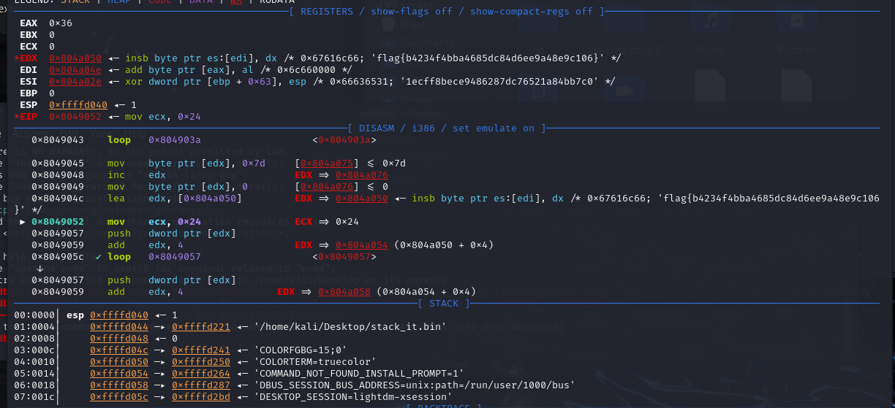

# StackIt

## Challenge Description
Binary file requiring stack analysis through XOR operations

## Solution
1. Analyzed binary using pwndbg debugger
2. Stepped through XOR operations in memory
3. Located flag in stack memory:

## Tools Used
- pwndbg