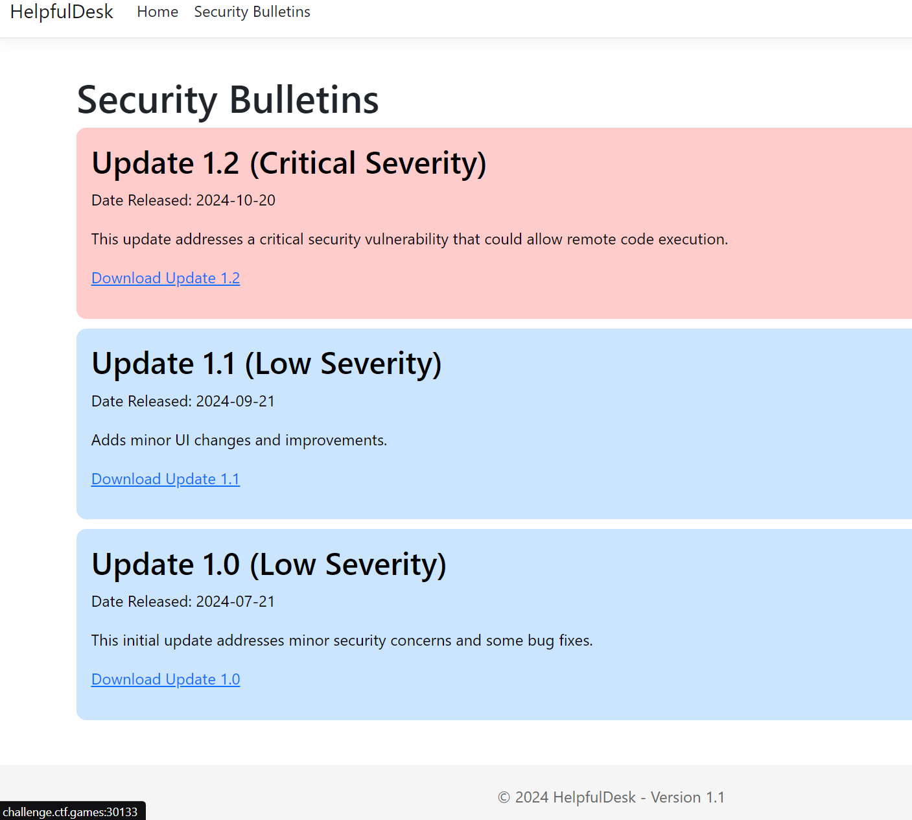

# HelpfulDesk

HelpfulDesk is the go-to solution for small and medium businesses who need remote monitoring and management. Last night, HelpfulDesk released a security bulletin urging everyone to patch to the latest patch level. They were scarce on the details, but I bet that can't be good...

## Solution
When visiting the website, we get a warning telling us that a security update is required. When visiting "Security Bulletins", we can see three versions, as shown in the image below.



On the very bottom of the page, is says that we are using version 1.1. That means that this version is vulnerable. Luckily, we can download the files used by the website.

The downloaded zip-file had a lot of files, but only a few interestring ones, namely "HelpfulDesk.dll" and "HelpfulDesk.exe". The exe-file could not be decompiled using ILSpy (a C# decompilation tool), so I tried to decompile the DLL, which was successful. Then, I started comparing each class for version 1.1 and 1.2, until I found one file that was different. It was the file under `HelpfulDesk.Controller -> SetupController`.

There was a small change in the file:

This:

```c#
string requestPath = base.HttpContext.Request.Path.Value;
			if (requestPath.Equals("/Setup/SetupWizard", StringComparison.OrdinalIgnoreCase))
```

.. was changed to this:

```c#
string requestPath = base.HttpContext.Request.Path.Value.TrimEnd('/');
			if (requestPath.Equals("/Setup/SetupWizard", StringComparison.OrdinalIgnoreCase))
```

**Problem in Version 1.1:**\
In version 1.1, the TrimEnd('/') was not present, meaning that paths with and without trailing slashes were treated differently. This allows an attacker to bypass the setup completion check by appending a trailing slash to the URL (/Setup/SetupWizard/), thereby accessing the setup page again even if the server had already been set up.

**Solution in Version 1.2:**\
In version 1.2, the TrimEnd('/') was added, ensuring that both paths with and without trailing slashes are treated the same. This prevents the bypass, blocking access to the setup wizard after the initial setup is completed, regardless of the URL's format.

So, to exploit this, I simply went to `/Setup/SetupWizard/`, which led my to a page that allowed me to create an administrator user. I then created a user and logged in.

I could then view the filesystems of different users, where one of them had a file called "flag.txt".