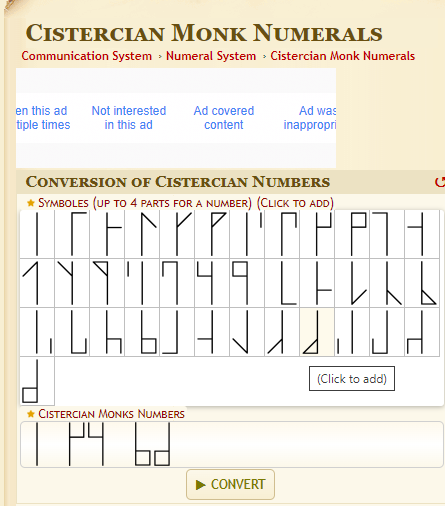

# IronKey

## Oppgavetekst
En tidligere IT-medarbeider har lagret en passordfil på en IronKey Vault. Disken er lagret i en safe sammen med et ark med diverse skriblerier. Du mistenker at passordet til vaultet står en plass i det arket. Klarer du å finne det?

Oppgi svaret i formatet: ctf(svar)

## Løsning
Denne oppgaven bruker "Cistercian Monk Numerals". Del opp figuren i disse symbolene så får du flagget.
