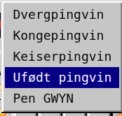

# Minesweeper Egg

## Løsning
Åpne opp "Ufødt pingvin" og eksploder en mine. Dette viser alle minene som er plassert i en rekkefølge som avslører egget. Om man ser nøye på minene, så kan man se teksten "EGG{RETRO}".

