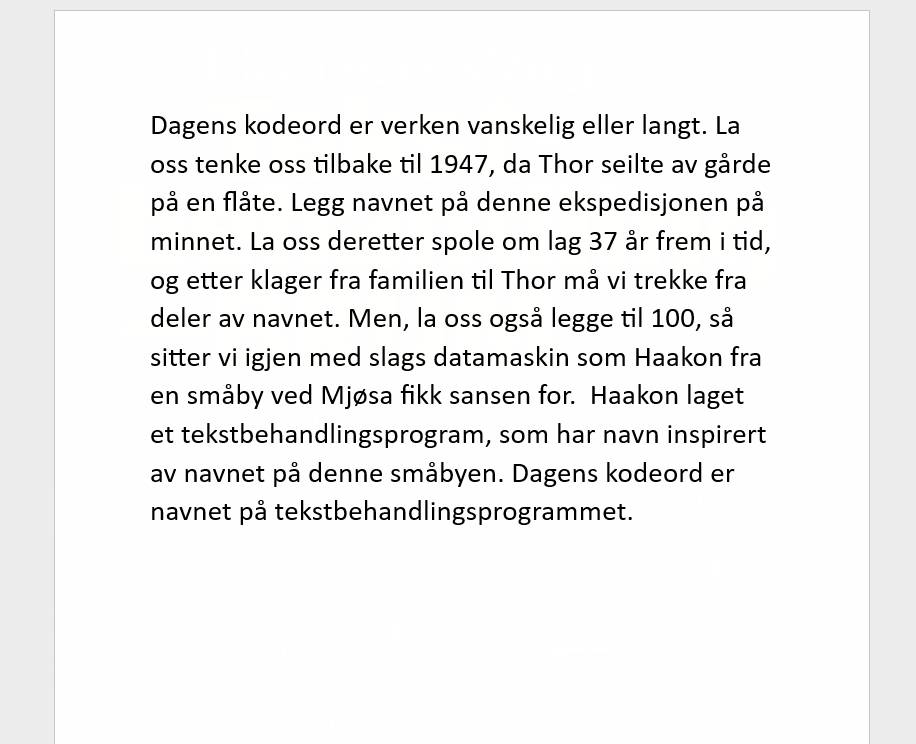

# Datakortet modul 2: Word
Du har nå kommet frem (eller tilbake) til sertifiseringstesten for modul 2, i det internasjonalt anerkjente «Datakortet» som i mer enn 20 år har sørget for inngående kunnskap i programvare som Word og Excel.

Undersøk filen modul2.zip og se om du finner frem til dagens kodeord...

## Løsning

Tid brukt: 1 timer og 15 minutter

I denne oppgaven fikk vi et Word-dokument. Jeg fant fort ut at det var hemmelig informasjon på det, da jeg unzippet hele dokumentet med kommandoen: `unzip Document.docx "*"`. Her fant jeg dette bildet:

Etter mye graving rundt på nettet fant jeg maskinen Tiki-100 og programmet laget av Haakon Wig.

https://hwiig.no/no/about \
https://www.djupdal.org/tiki/program/

Kodeord: brum
