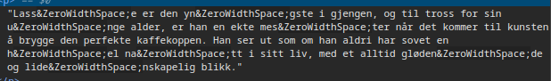

# Undercover
Det norske kodekalender-markedet er ikke så stort, men de siste årene er det flere aktører som har gjort seg bemerket. Noen som kanskje ikke har gjort seg så veldig bemerket er gjengen bak kodekalender.no.

Til tross for begrenset suksess, fikk de inn en lærling på slutten av 2023. Nå går det rykter om at denne lærlingen egentlig er en 38 år gammel spesialagent på undercover-oppdrag fra en av de ledende kodekalender-aktørene i Norge.

Finn frem til teksten om denne lærlingen på kodekalender.no sine nettsider, og se om om du kan finne et kodeord skjult i teksten.

Lykke til!

## Løsning

Tid brukt: 9 minutter

Jeg fant beskrivelsen til lærlingen på bunnen av `/ansatte/`. I beskrivelsen hans var det noe merkelig om man inspiserte elementet. Det var fullt av "&ZeroWithSpace" i teksten, som kun er synlig om man ser på kildekoden. For å finne svaret tok jeg første bokstav foran hver ZeroWithSpace.

Kodeord: snushøne
