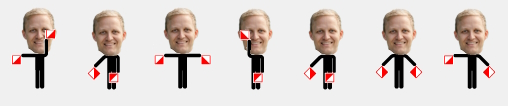

# Skal vi danse?
Hils på Kenneth Sætereng! Kenneth er en sindig og erfaren systemutvikler med erfaring fra 2010 innen både backend og frontend. De siste årene har han jobbet med store løsninger som Stortinget, Skatteetaten, Optimera og NHO.

I Novacare jobber han med både nyutvikling og forvaltning for flere av våre godt fornøyde kunder. Faglig fokus er på Azure, .NET og headless-systemer som Contentful og Sanity. Kenneth er ingeniør fra Høgskolen i Oslo og Akershus innen programutvikling, systemutvikling og databaser.

Når han ikke jobber liker han å danse. Sammen med kona underviser og konkurrerer han i West Coast Swing, en moderne pardans som opprinnelig kommer fra USA. En gang i måneden reiser de på danseeventer rundt om i Europa (I hvert fall gjorde de det før familieforøkelse).

Dans handler mye om formidling. Se om du forstår hvilket kodeord Kenneth forsøker å formidle med dansen på bildet under!

## Løsning

Tid brukt: 5 minutter (begynte sent)

Jeg ble opprinnelig misledet av teksten og antok at det dreide seg om "Dancing Men Cipher". Dette viste seg imidlertid ikke å være tilfellet. Raskt etterpå oppdaget jeg "Semaphore Cipher" på dcode.fr, da jeg valgte alternativet "Symbols Cipher".

Kodeord: PARDANS

