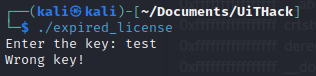
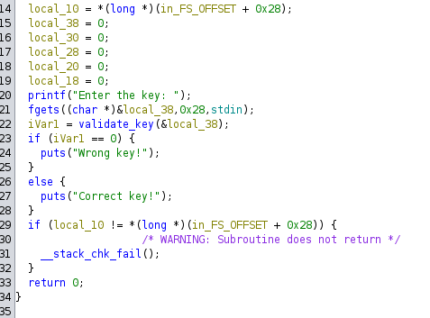
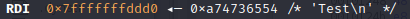
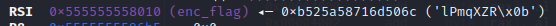
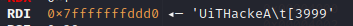
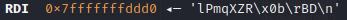
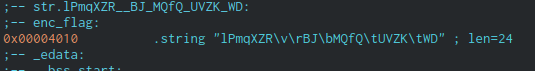
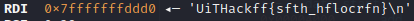
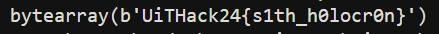
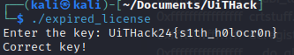

## Expired License
In this task, we are given a binary called *expired_license* where we are supposed to find a license key. First thing that I always do with binary files, is to try execute it:



The program expects input from main, where the license key should be inserted. Upon further inspection with Ghidra, we cannot bitflip to get a flag out of the binary itelf, since the "license key" is most likely supposed to be the flag itself.



From here, I launched the binary with pwndbg (gdb but better). I ran til I had to insert an input to the fgets function, which I wrote "Test".



After that, I started analyzing what and how the program was checking whether the key was correct. This happened in a **validate_key** function.


It appears that the input gets shifted one way or the other, and by multiple tests I can sense there is a pattern to this. There also seems to be a specific length required, and it seems that the number *9* seems to be a factor because of what happens when I step through the rest of the letter shifting process (*I assume the 3 is because of the \n newline command*):

 

Furthermore, forward in the validating process, I noticed a rather interesting string from **enc_flag** (encrypted flag I suppose).



Out of pure curiosity, I assumed that there is a two-way encryption. So I tested this string as a key and debugged through.



Sure enough I was on the right track, and to reaffirm my beliefs that it is a two-way encryption scheme, i inserted the typical beginnings of the flag used in this CTF and got this when typing in *UiTHack24{}*:



So since this is true, then there seems to be an issue with the *\x0b* since it doesn't translate back that well... I did further research in a program called **Cutter** to check its strings. And sure enough, I found this:





I tried both of the strings listed. I assume everything is correct, except for the areas with **f**. This tells me that all the lines with: 
1. \v
2. \r
3. \b
4. \t

Gives wrong decryptions, so I started using the decompiled version of the decryption function.

```python
def enc1(data, param_2):
    # Convert the input string to a mutable byte array for XOR operation
    encrypted_data = bytearray(data, 'utf-8')
    
    # Perform the XOR operation for the first 24 bytes or the length of the data, whichever is smaller
    for i in range(min(24, len(encrypted_data))):
        encrypted_data[i] ^= param_2
    
    # Return the resulting encrypted data as a byte array
    return encrypted_data

# Example usage
enc_flag = 'lPmqXZR\v\rBJ\bMQfQ\tUVZK\tWD'  # This should be set to the expected value
dec_flag = enc1(enc_flag, ord('9'))
print(dec_flag)
```
I ran this first with the partial string, which worked. Then I tried to insert the \v \r \b \t as mentioned from the list, which finally gave me the flag **UiTHack24{s1th_h0locr0n}**:



Which also works as the license key:


