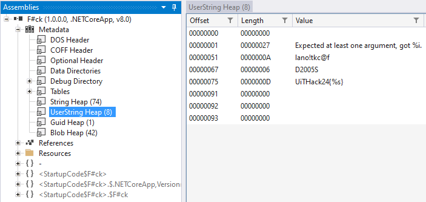

## F\#ck, a functional nightmare
In this task, we were given a *.dll* file called "F\#ck.dll". And based on the name of the *.dll* file, we have already been given the hint that it is related to the functional programming language called **F\#**.

First thing that was done, is to analyze its contents with a program called **[ILSPY](https://github.com/icsharpcode/ILSpy)** which is an open source .NET assembly browser and decompiler. When using this program, the area of interest tends to lie inside *UserString* (as the program usually waits for a very specific input). And right I was:



We can already see a few interesting things here:

1. "Expected at least one argument, got %i.": This tells us that the program itself expects a parameter when main is run.
2. "lano!tkc@f": A very interesting string, you will see why soon.
3. "D2005S": Another string, at this point I already assumed this would be the string the program expected.
4. "UiTHack24{%s}": The half-complete flag with a string insert.
   
Now that we know a few parameters, we can make a F# script that runs the program! We will be using the .fsx file extension which is literally just a F# script file that works the same way as a normal python script. But first, let's find out how to start the program:


From here you can see that the entrypoint is "**Program.main**", which is all we need at this point. Let's make the .fsx script:

```
#r "F#ck.dll"

open Program
let test = Program.main [| "D2005S";|]
```

#r "F#ck.dll" adds the .dll as a module, then we can open the Program through its entrypoint and call its main function with the "string array" (Has to be formatted like [|"%s"|]) in the same call.

This will run, and give us the flag: "**UiTHack24{f@ckt!onal}**". Does it look familiar? Remember the number 2 of the list? It *is* the flag represented in %s just backwards, which *usually* happens when decompiling code.
