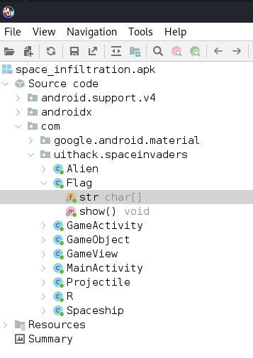

## Infiltration
This task we were given an .apk file called: *"space_infiltration"*. From here, you can download, install and use a tool called **jadx-gui** which you can open the .apk file with as its corrupted in some way (missing some files or the manifest is plain broken?). There I found some classes, one which was called "Flag".



This class had code which seems to be a way of printing out the flag.

```java
package com.uithack.spaceinvaders;

/* loaded from: Space Infiltration/classes */
public class Flag {
    public static char[] str = {'x', 'D', 'y', 'e', 'L', 'N', 'F', 31, 25, 'V', 'z', 'E', 30, '_', 30, 'r', 28, 24, 'r', '@', 'T', 'r', 'N', 'X', ']', 'r', 29, 'K', 'r', 'G', 25, '[', 25, 18, 'P'};

    public static void show() {
        for (int i = 0; i < 35; i++) {
            System.out.print(str[i] ^ '-');
        }
    }
}
```

By turning this code into a python file (through my trustworthy ChatGPT 4), I could run the code and get the flag **UiTHack24{Wh3r3_15_my_cup_0f_j4v4?}**.


