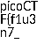

# Secret of the Polyglot
The Network Operations Center (NOC) of your local institution picked up a suspicious file, they're getting conflicting information on what type of file it is. They've brought you in as an external expert to examine the file. Can you extract all the information from this strange file?

Download the suspicious file [here](https://artifacts.picoctf.net/c_titan/8/flag2of2-final.pdf).

## Solution
We get a PDF file. If we open the file, half of the flag is written in the bottom: `1n_pn9_&_pdf_249d05c0}`

The get the first half, we can use the title of the task as a hint. Polyglot files are files that contain several filetypes. Knowing this, we can run the tool "foremost", which finds file signatures and extracts them.

`foremost lag2of2-final.pdf:`

This gives us the following output:

picoCTF{f1u3n7_1n_pn9_&_pdf_249d05c0}

